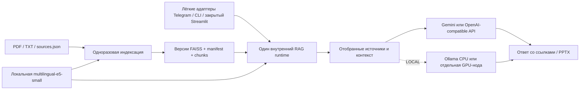

# Local-first Hybrid RAG: design specification и техническое ревью

Дата ревизии: 2026-09-30. Ревизия 3 с обязательными уточнениями независимого ревью.
Спецификация ревизии 3 утверждена пользователем 2026-09-30.
[Новый implementation plan](../plans/2026-09-30-local-first-vps.md) подготовлен
на её основе и ожидает отдельного согласования. Production-реализация не начата.
Репозиторий: https://github.com/vitalpicnic/rag, локальная база `b2c8022`.
Исходные документы опубликованы в `8c2326c`, ссылки README — в `bd86a18`.
Результаты аудита ниже относятся к 2026-09-29; текущая ревизия меняет только
спецификацию и её статус в README. Код приложения не изменялся.
Предыдущий brainstorming сформировал архитектурный проект; ревизия 3 затем
прошла повторное согласование. Сейчас разрешена подготовка нового плана.
Файл `docs/superpowers/plans/2026-09-29-local-first-vps.md`
относится к ревизии 2, не актуален и не разрешает реализацию. Он не изменяется.
Новый implementation plan допустим только после повторного утверждения этой
спецификации; выполнение — после отдельного согласования нового плана.

## 1. Цель и границы

Перенести существующее приложение на один Linux VPS: документы, embeddings,
FAISS, подготовленные таблицы и поиск остаются на сервере; генерация выполняется
внешней LLM через Gemini либо OpenAI-compatible API. Опционально генерация
переключается на Ollama на том же сервере или отдельной GPU-ноде без изменения
retrieval. Наличие GPU не должно быть обязательным для HYBRID.

Сохраняются Telegram, CLI, Streamlit, четыре аналитических режима, проверяемые
источники и страницы, реестр официальной отчётности, PPTX, проверенные банковские
графики, история, метрики, атомарная публикация и контроль целостности индексов.
Сбор Telegram-каналов через пользовательскую учётку остаётся вне задачи.

Профиль HYBRID означает локальную обработку и внешнюю генерацию. Отдельное
понятие hybrid retrieval означает FAISS + BM25: оно включено в этап 5 вместе
с опциональным reranking и последовательными экспериментами A–F. Эти два
переключателя независимы. Kubernetes, Redis, PostgreSQL, отдельный
публичный REST API и публичная регистрация пользователей не требуются.

Local-first не означает отсутствие передачи данных: внешняя LLM получает вопрос,
отобранные фрагменты и ограниченную историю, Telegram — вопросы, ответы и явно
запрошенные файлы. Полный корпус не отправляется на embedding API в локальном
профиле. Автоматического перехода на облачные embeddings при локальной ошибке нет.

## 2. Результаты аудита

| Наблюдение | Основание | Требуемое изменение |
|---|---|---|
| Embeddings документов и вопросов всегда Google | `build_index.py:create_embeddings`, `rag/engine.py:setup_rag_chain` | Независимые фабрики embeddings и LLM; локальный профиль без Google-ключа |
| Пространство векторов жёстко задано: Gemini, 3072 измерения | `rag/index.py:DEFAULT_SETTINGS` | Профиль модели в fingerprint; явная проверка пространства на сборке и чтении |
| FAISS уже имеет версии, manifest, хеши, блокировку сборки и атомарный current.json | `rag/index.py` | Сохранить свойства; добавить проверяемое переключение и откат версии |
| Старый docstore десериализуется через pickle | `rag/index.py:_load_version` | Новые индексы без pickle; контролируемая совместимость с доверенными старыми версиями |
| Проверка актуальности перечитывает корпус и артефакты на каждый запрос | `rag/index.py:current_index` | Кэш VerifiedSnapshot, invalidation и периодический verifier; full hash исключён из hot path, см. 4.3.2 |
| Генерация напрямую зависит от Gemini | `rag/engine.py`, `rag/models.py` | Сохранить Gemini; добавить опциональный адаптер Ollama с отдельными параметрами |
| Метрики retrieval всегда помечены как gemini-embedding-001 | `rag/pipeline.py` | Записывать фактические провайдер и модель; не приписывать Google стоимость локальных операций |
| Пути привязаны к директории исходного кода | engine, bot, build_index, tables, metrics | Общая конфигурация root для постоянных данных; прежнее поведение вне Docker |
| Нет Dockerfile, Compose, Linux provisioning и процедуры восстановления | Корень репозитория | Реальные файлы инфраструктуры и скрипты, а не инструкции агенту |
| Пустой список разрешённых Telegram ID открывает бота всем | `bot.py:authorized` | В production-профиле требовать allowlist; прежний локальный режим сохранить явно |
| Streamlit не имеет пользовательской аутентификации | `app.py` | Публиковать только на loopback VPS; доступ через SSH-туннель |
| Ключи читаются из окружения/.env; поддержки файлов секретов нет | `.env.example`, запуск провайдеров | Поддержка переменных *_FILE для Compose secrets; исключение секретов из image/context/logs |
| `bot.py --check` сообщает not_ready, но не делает запуск проверки неуспешным | `bot.py:main` | Отдельная строгая readiness-проверка с ненулевым exit code |
| Зафиксированы прямые, но не все транзитивные зависимости | requirements-файлы | Linux lock-файлы с хешами, CPU-зависимости отдельно от GPU |
| CI проверяет Python, но не контейнеры | `.github/workflows/tests.yml` | Сборка образа, Compose validation, offline smoke и восстановление в Linux CI |

### 2.1 Фактический baseline повторного аудита

2026-09-29: штатный `unittest discover -s tests` выполнен через TextTestRunner
с фиксацией каждого passed/skipped/error в JSON. **78 passed, 0 failed,
0 errors, 0 skipped**, Python 3.14.3, Windows 11, exit code 0.
Отчёты: `reports/stage0-baseline-2026-09-29.json` и одноимённый `.log`;
они локальные и исключены из Git. Первое сохранение отчёта завершилось
PermissionError песочницы; повторный запуск с разрешением успешно сохранил
результат. Ошибка записи не была ошибкой теста приложения.

Оба условных теста реального банковского PDF выполнены, а не пропущены:
`TableTests.test_real_pdf_values_roundtrip_and_png` и
`TableTests.test_missing_and_modified_table_fail_closed`. Первый проверяет
10 наблюдений, SQLite roundtrip, значения и PNG; второй — отказ при повреждении
таблицы. Работа идёт с временными БД, production SQLite не изменялась.

Проверен существующий evaluation-набор через `read_dataset/check_dataset`:
30 cases, 43 проверки цитируемых фрагментов, 0 несовпадений, 47 файлов корпуса.
Фактически runner запускает 28 случаев в text и 2 в overview; executive/expert
не покрыты. Отсутствие поля mode в JSON не означает, что все 30 запускаются text:
`rag/evaluation.py:62` выводит режим из category.

- SHA-256 evaluation-набора: `3340cef9f9adc5f452f30e00b25eeaeed6535e74f5850c8747844b155e9fee93`.
- Версия корпуса по штатному evaluator: `49b873fe08f88203359e44d840db73bb50ff0b633e85b0ee65a2bcdeb352001a`.
- `faiss_indexes/Банкинг/current.json` и директория этого индекса отсутствуют.
  Readiness для evaluation: **not ready**, это не успешный retrieval.
- Gemini quality baseline A: **not_run**; исходный код и gold evidence сохранены,
  но измеренных Recall/accuracy/стоимости Gemini в этом аудите нет. Никакие
  production-индексы не строились и не переключались.
- Из Git отслеживаются только `data/README.md` и `reports/README.md` среди
  проверенных путей данных; `.env`, corpus, faiss_indexes, prepared_tables не tracked.

Unit baseline не проверяет внешние API, реальный локальный embedding,
Linux/Python 3.12, конкурентную нагрузку или GPU.

Docker CLI 29.4.3 и Compose 5.1.4 доступны при проверке вне песочницы.
Docker Desktop Linux Engine недоступен: named pipe отсутствует.
VPS ещё не выбран; SSH-развёртывание и нагрузочное испытание не выполнялись.

## 3. Базовый VPS и отдельный стенд измерений

| Параметр | Основной VPS и обязательный стенд приёмки | Дополнительный экспериментальный стенд |
|---|---|---|
| ОС | Ubuntu Server 24.04 LTS, x86_64 | Та же |
| CPU | 4 vCPU | 4 vCPU, фактическую модель CPU записать |
| RAM | 8 ГБ | 16 ГБ |
| Диск | 80 ГБ SSD/NVMe как начальная оценка | SSD/NVMe, объём и свободное место измерить |
| GPU | Не нужен | Не нужен |
| Режим работы | Один polling-бот, опциональный закрытый Streamlit | Нагрузка 1/2/4 клиента, все роли |

Предыдущая оценка 2 vCPU / 4 ГБ больше не является целевой конфигурацией.
База 4 vCPU / 8 ГБ задана пользователем; приёмка на ней ещё не выполнена.
Начальная область измерения — до 10 000 фрагментов с указанием реального размера,
а не обещание верхнего предела корпуса. Индексация сначала запускается отдельно
от пользовательской нагрузки. Для
предотвращения двойной загрузки модели сохраняется один экземпляр на процесс,
общий для тем и интерфейсов: модель держит только один внутренний RAG runtime.
Swap допускается как аварийный запас, но не как замена RAM.

Для 10 000 векторов по 384 float32 сами векторы занимают около 14,6 МиБ;
к этому прибавляются модель, Python/PyTorch, документы, метаданные и временная
память построения. Планирование диска учитывает исходный корпус, ограниченное
число образов/версий и резервные копии вне этого VPS.

### 3.1 Бюджет основного VPS — лимиты, не измеренные RSS

| Компонент | Memory limit | CPU limit | Ограничение |
|---|---:|---:|---|
| Общий RAG runtime с embedding и FAISS | 3,5 GiB | 2,5 vCPU | 1 worker, 1 активный запрос, очередь 8 |
| Telegram adapter | 384 MiB | 0,25 vCPU | 1 polling, без моделей |
| Streamlit adapter, отключаемый | 768 MiB | 0,5 vCPU | Без моделей/FAISS |
| Health/служебный collector | 128 MiB | 0,25 vCPU | Небольшие периодические проверки |
| Хост/Engine/системный запас | Не менее 1,5 GiB | Остаток | Не контейнерный лимит |
| Indexer, только вместо runtime | 4,5 GiB | 3 vCPU | 1 job, batch 8, threads 2 |
| Reranker | Выключен | — | Только после измерений |
| Ollama | Не входит в основной бюджет | — | Отдельная нода или эксперимент |

Обычные контейнеры суммарно ограничены 4,75 GiB; окно индексации с адаптерами —
5,75 GiB. Bootstrap проверяет реальный MemTotal, а не маркетинговые GB:
MemTotal−сумма активных limits должна быть не меньше 1,5 GiB. Если не помещается,
web/collector останавливаются в maintenance window. Swap не считается RAM.

Модель одна на весь VPS runtime; фронтенды её не загружают. Index LRU cache
ограничен 512 MiB оценённой памяти FAISS+docstore и включён в 3,5 GiB runtime.
Прежде загрузки следующей темы неприкреплённый к запросу индекс выгружается.
Слишком большой индекс/прогноз RAM выше лимита → not_ready, а не попытка загрузить
всё. Начальный предел 100 000 chunks — защитный лимит, не обещание производительности.

Очередь общая для CLI/bot/web, ожидание до 60 с; переполнение даёт ошибку занятости.
Отмена клиентского ожидания не освобождает слот до фактического завершения inference.
При превышении ресурсов: отключить web/reranker, снизить batch до 1–8, сохранить
concurrency=1 или вынести indexer/Ollama. Обязательный HYBRID не требует GPU.

Диск первоначально 80 GB SSD как оценка, свободный резерв не менее 20% для staging
и rollback. Логи ограничены, например 3×10 MiB на контейнер. Индексы и backups
автоматически не удаляются; при нехватке диска сборка не начинает публикацию.

LOCAL с Qwen3 8B/14B не обещается как комфортный режим на базовых 8 ГБ.
Проверка этих моделей идёт на 16 ГБ и/или GPU-ноде; quantization, context length,
KV cache, digest и ограничения concurrency фиксируются. Размер файла весов
не равен необходимой RAM. Если 14B не помещается с резервом, результат —
resource_blocked с конкретным предложением отдельной ноды/снижения контекста.

## 4. Архитектура



Рассмотрены три подхода:

1. **Один общий RAG runtime — выбран для 4 vCPU / 8 GB.** Один процесс владеет
   embedding-моделью, FAISS-кэшем, историей и общей очередью всех интерфейсов.
   Тонкие адаптеры обращаются к нему через закрытый внутренний HTTP/JSON transport.
   Это предотвращает дубли моделей и индексов; цена — небольшой внутренний API.
2. Embedding-сервис при отдельных RAG-процессах экономит память модели, но
   дублирует FAISS/кэши и усложняет общий admission. Модели внутри каждого UI
   отклонены из-за прямого дублирования памяти. В первом варианте оба не нужны.
3. Полностью локальная LLM на CPU — поддерживается профилем LOCAL, но не является
   основным production-вариантом для 8 ГБ. Нагрузка калибруется отдельно;
   предусмотрена GPU-нода с тем же контрактом Generation Provider.

### 4.0 Профили и независимые компоненты

| RAG_PROFILE | Embedding Provider | Generation Provider | Политика |
|---|---|---|---|
| HYBRID | local | gemini или openai_compatible | Основной VPS; ключ только выбранного генератора |
| LOCAL | local | ollama | Никаких внешних LLM/embedding API; модели заранее загружены |
| CLOUD | google | gemini | Исходный Gemini embedding-профиль и совместимость schema v1 |

В Compose по умолчанию HYBRID. Для прежнего запуска без RAG_PROFILE сохраняется
явно документированный CLOUD-default, чтобы не ломать существующий .env/индекс.
LOCAL + Gemini и CLOUD + local отклоняются, а не «исправляются» автоматически.
Профиль меняет провайдеров, режим text/overview/executive/expert — инструкции
и глубину retrieval. Эти настройки не должны смешиваться.

LOCAL блокирует создание внешних клиентов до импорта их SDK; случайно заданный
GOOGLE_API_KEY не разрешает обращение к Google. Ollama ограничена выделенным
закрытым endpoint; cloud-функции отключены, разрешены только заранее загруженные
локальные model digests. В однохостовом offline Compose сеть приложений/Ollama
internal, bootstrap download выполняется отдельно. Для GPU-ноды — allowlist
private endpoint и egress-правила. Проверяется реальный ответ с отключённым WAN;
одной проверки имени провайдера недостаточно. Telegram при этом требует сеть
Telegram; полностью отключённый интернет проверяется через CLI, не polling.

| Компонент | Реализация/граница | Контракт |
|---|---|---|
| Generation Provider | `rag/generation.py`, адаптеры Gemini/OpenAI-compatible/Ollama | Сообщения → AIMessage с usage и моделью; таймаут, retry, лимит вывода |
| Embedding Provider | `rag/embeddings.py` | embed_documents/embed_query + immutable embedding fingerprint |
| Document Processing | `rag/documents.py`, выделение существующего extract_chunks | PDF/TXT → chunks с прежними source/page/chunk ID |
| Index Manager | `rag/index.py`, CLI `scripts/manage_index.py` | Проверка, версия, атомарная публикация/активация/откат |
| Retrieval | `rag/retrieval.py`; IndexRetriever остаётся совместимым адаптером | Вопрос + режим → ранжированные документы с метаданными |
| Evidence Validation | `rag/evidence.py`, `rag/sources.py`, `rag/tables.py` | Структура ссылок отдельно от проверенных числовых фактов |
| RAG Orchestrator | `rag/pipeline.py`, wiring `rag/engine.py` | Retrieve → evidence → generation → validation; без знания UI |
| Interface Adapters | bot.py, main.py, app.py | Сессии, авторизация, очередь, файлы; общий engine |
| Evaluation | rag/evaluation.py, scripts/evaluate_rag.py | Версионированный набор, результаты/статусы/ручная разметка |
| Observability | rag/metrics.py, rag/health.py, scripts/benchmark_rag.py | События по стадиям, readiness, ресурсы, раздельная стоимость |

Это границы модулей существующего приложения, а не требование десяти сервисов.
Runtime — один worker без auto-reload и multiprocess model preload. Существующие
интерфейсы меняют только transport, авторизацию и обработку занятости; общий
engine и форматы ответов сохраняются. Внутренний API не публикуется на хост:
request/result/status/source/PPTX, сервисный секрет, проверка adapter identity,
principal/topic и привязка результата к сессии. Нельзя доверять произвольному
session_id из текста запроса; чужой source/PPTX и path traversal отклоняются
повторно в runtime. Это не публичная API-платформа.

На основном VPS indexer работает только в maintenance window: закрыть admission,
дождаться активного запроса, остановить runtime с выгрузкой модели/индексов,
передать singleton lock владельца модели indexer, выполнить job, затем проверить
и запустить runtime. Одновременные runtime/indexer с двумя моделями запрещены.
Frontend показывает обслуживание. No-downtime indexing на 8 GB не обещается;
вынос indexer на отдельный сервер возможен без смены retrieval-контракта.

### 4.1 Конфигурация приложения

Новый модуль `rag/config.py` валидирует настройки до загрузки моделей.
Конфигурация окружения и файлы секретов работают независимо от наличия .env.

- `RAG_ENV=development|production`: политика эксплуатации, независимая от LOCAL.
- `RAG_PROFILE=HYBRID|LOCAL|CLOUD`: матрица выше.
- `RAG_DATA_ROOT`: общий корень постоянных данных; по умолчанию корень проекта.
- `RAG_EMBEDDING_PROVIDER=google|local`: Google сохраняется для прежних запусков,
  Compose явно выбирает local.
- Локальные model ID, revision, путь к кэшу, offline-режим, batch size и число CPU
  threads задаются явно и проверяются.
- `RAG_LLM_PROVIDER=gemini|openai_compatible|ollama`; `RAG_MODEL` сохраняет назначение.
- OpenAI-compatible: обязательные base URL/model, собственный ключ и *_FILE;
  не пересылать Gemini thinking-параметры произвольному совместимому серверу.
- `GOOGLE_API_KEY_FILE`, `TELEGRAM_BOT_TOKEN_FILE`: содержимое читается приложением,
  секретные значения не выводятся. Конфликт env/file отклоняется явно.
- `OLLAMA_BASE_URL` и имя модели применяются только при выборе Ollama.

Существующие CLI-аргументы сохраняются. Readiness не обращается к платной LLM.
Неизвестный провайдер, неверные лимиты или недоступная локальная модель дают
понятную ошибку до обработки пользовательского вопроса.

#### 4.1.1 Передача конфиденциальных данных в HYBRID

Внешняя LLM получает вопрос, ограниченную историю и выбранные фрагменты с
минимальными source labels. Не полный корпус, secrets или абсолютные пути.
Production-политика темы: `external_generation=deny|allow`, по умолчанию deny.
Владелец явно разрешает конкретный provider/endpoint после проверки его условий
обработки и хранения. Source-level deny сильнее разрешения темы. Неутверждённые
материалы обслуживаются LOCAL или получают отказ. Privacy metadata отделены
от PDF/TXT и embedding IDs; произвольный endpoint из запроса запрещён.

Внешний countTokens тоже передаёт данные и проходит privacy gate до вызова.
Маскирование не считается доказанным обезличиванием. Логи не содержат prompts,
ответов, документов или ключей. Evaluation-отчёты с текстом доступны оператору,
retention по умолчанию 30 дней, продление явное. Backups защищены отдельно.

#### 4.1.2 Token-aware budget полного запроса

Сейчас evidence ограничен символами, история оценивается UTF-8 bytes/4.
Это не общий token budget. Generation Provider для конкретной модели сообщает
input/output/context limits, tokenizer/count endpoint, framing overhead и
правила учёта thinking. Нельзя переносить оценку токенов одной модели на другую.

Считаются S — system prompt и инструкции роли, Q — текущий вопрос,
H — полные пары истории, E — evidence с citation headers, F — chat/schema overhead.
R резервирует output и thinking согласно контракту провайдера.
Safety margin M = max(256 токенов, 5% эффективного лимита).

```text
S + Q + H + E + F + M <= input_limit
R <= output_limit
S + Q + H + E + F + R + M <= context_limit  # если окно общее
```

Application input cap первоначально 16 384, ограниченный capabilities модели.
Output budgets: text 600, overview 1800, executive 1800, expert 3000, каждый
не выше provider limit; thinking policy/резерв явные. Это настройки приложения,
а не заявление о физических лимитах всех LLM.

Сначала резервируются S/Q/F/R/M. История ограничена 800 токенами текущей модели;
при нехватке удаляются старейшие полные пары. Затем подбираются целые evidence
units с приоритетом официального источника и альтернативы, если они помещаются.
Нельзя обрезать число, дату, единицу или citation header посередине. Полный
payload пересчитывается после сборки; при превышении удаляются units и проверка
повторяется. Не помещается обязательный prompt/вопрос либо не хватает evidence —
отказ до generation. Текущий вопрос незаметно не усекается.

Gemini: точный финальный countTokens после privacy gate. LOCAL: локальный
tokenizer/chat template, соответствующие model digest. Compatible API требует
проверенного tokenizer mapping либо документированного count endpoint и limits.
Неизвестный контракт не допускается в production; bytes/4 не выдаётся за точность.
Недоступность обязательного счётчика даёт диагностический отказ, не обход budget.
Фактический usage служит аудитом расхождений, не заменяет preflight.

Тесты: русский/Unicode/таблицы, длинный system prompt, история, четыре роли,
малое окно, thinking reserve и разные tokenizers; oversized payload не достигает
generation. Изменение budget — отдельный quality control arm, не скрытая смена
условий эксперимента embeddings.

### 4.2 Локальные embeddings

Базовая модель — `intfloat/multilingual-e5-small`, CPU, 384 измерения.
Для retrieval нужны разные префиксы `query: ` и `passage: `, в том числе для
русского текста; применяется нормализация. Это требования модели, а не
взаимозаменяемые параметры. Ограничение длины модели учитывается при обработке
вопросов и фрагментов; длинные входы не должны незаметно терять текущий вопрос.

Используется Sentence Transformers с CPU-сборкой PyTorch. Revision модели,
зависимости и параметры фиксируются при реализации после проверки совместимости
на Python 3.12/Linux. `trust_remote_code` не включается.
Отдельная bootstrap-команда скачивает модель один раз; runtime читает локальный
кэш без автоматического скачивания или скрытого сетевого fallback.

### 4.3 Индексы и миграция

Идентификаторы вычисляются по каноническому JSON, без timestamp, абсолютных
путей и секретов. Legacy Gemini fingerprint остаётся неизменным для старого кода.

| Идентификатор | Содержимое | Независим от |
|---|---|---|
| corpus_id | Отсортированные относительные source paths и content SHA-256 | LLM, embedding, ролей, registry |
| chunks_id | corpus_id + extraction/chunking/schema и версии обработки | LLM и embedding при неизменной подготовке |
| embedding_profile_id | provider/model/revision/dimension, normalization, query/doc prefixes, tokenizer/max length/pooling, encoding runtime versions | LLM, endpoint, UI, ролей |
| index_version | chunks_id + embedding_profile_id + FAISS settings/format + immutable build version | Переключения LLM |
| registry_id / policy_id | Хеши source registry и политики доступа | Не требуют перестройки векторов |

Prepared corpus адресуется по chunks_id и используется разными embedding
профилями. Смена extraction создаёт новые chunks; смена embedding — новые
векторы даже при той же размерности; смена LLM не меняет ни chunks, ни индекс.
BM25/reranker получают независимые sidecar IDs. Старые артефакты не удаляются.

Новые версии: отдельный namespace по embedding_profile_id, schema v2 с JSONL
docstore и явным row→chunk_id mapping. Legacy current.json не переписывается.
Один новый `active.json` указывает согласованный bundle: index path/version,
corpus_id, chunks_id, embedding_profile_id и manifest hash. Embedding Provider
выбирается по bundle и сверяется с разрешённой конфигурацией. Нельзя переключать
env и index pointer двумя независимыми операциями.

Публикация: staging build → full verify → fsync файлов/каталога → atomic rename
в пределах одного filesystem → verify конечной версии → fsync и os.replace
active.json → fsync каталога указателя. Один publish lock исключает гонку.
Прерывание до публикации оставляет прежний bundle; ошибка API не меняет его.
Рантайм читает только полностью проверенные версии, один pinned snapshot на запрос.

На 8 GB активация проходит после остановки admission и выгрузки старой модели,
без двух одновременно загруженных пространств. Краткий not_ready допустим.
Ошибка загрузки нового snapshot возвращает прежний проверенный bundle, не
включает другой облачный провайдер. Административный writer выполняет замену
указателя; read-only runtime подтверждает готовность до открытия admission.

Rollback проверяет старый bundle и соответствующий corpus snapshot, атомарно
выбирает его, прогревает модель/индекс и открывает admission. Нет переэмбеддинга
и удаления новых файлов. При изменённом корпусе сначала явно восстанавливается
согласованная копия в новый root; production PDF автоматически не переписываются.

#### 4.3.1 Доверие к index.pkl

SHA-256 обнаруживает повреждение, но не подтверждает происхождение, если
атакующий может заменить pickle, manifest и pointer. Новый network-facing runtime
не выполняет pickle.load. Legacy поддерживается одноразовой административной
миграцией доверенного индекса в schema v2 на копии, без пересчёта векторов;
исходный индекс остаётся пригодным для прежнего кода.

Миграция проводится после проверки прав/владельца и доверенного backup provenance:
non-root контейнер без сети и API secrets, read-only legacy input, отдельный
writable output. Хеши обязательны, но не заменяют эту границу доверия. Чужие
pickle не принимаются. До принятия результата сверяются векторы, их порядок,
mapping и source/page/chunk ID. Переход Google→local всегда строит новые векторы.

#### 4.3.2 Проверенное состояние и окно обнаружения изменений

Нынешний путь invoke→current_index→inspect_corpus/_hash заменяется кэшем
VerifiedSnapshot. Full SHA-256 выполняется на старте до readiness, при публикации
и активации новой версии, после restore, вручную и периодически раз в 3600 с
после окончания предыдущего успешного scan. Не на каждый пользовательский вопрос.

Ключ кэша: root/topic/bundle ID + manifest hash + verifier/schema version.
Запись содержит проверенные manifest/FAISS/docstore, stat signatures,
registry/policy IDs и время успешной полной проверки. Максимальная давность
успешного scan — 7200 с; превышение блокирует новые запросы. После рестарта
сохранённому флагу «проверено» не доверяют: нужен полный verify.

Hot path проверяет маленький active.json/его stat signature и кэш, не обходит
корпус и не хеширует PDF/FAISS. Publish/restore event, смена pointer/settings или
invalidation flag закрывают admission темы до проверки. Background watcher
каждые 30 с сравнивает состав файлов и size/mtime_ns/inode корпуса и артефактов.
Изменения/добавления/удаления инвалидируют тему. Registry/policy обновляются по
событию и watcher; штатный отзыв доступа немедленный и повторно проверяется
перед передачей фрагментов внешнему провайдеру.

Перед внешним вызовом и выдачей ответа повторно проверяются поколение
инвалидации, срок проверки и права доступа. Если закреплённый snapshot отозван
или признан повреждённым во время запроса, результат не выдаётся. Это не
устраняет описанное ниже окно обнаружения неизвестного изменения файлов.

Full verifier последователен, с низким CPU/I/O приоритетом; проверяет immutable
версию. До/после scan должны совпасть signatures и поколение pointer.
Hash mismatch, ошибка чтения или гонка блокируют readiness темы; повторные
одновременные запросы не запускают одинаковые проверки. Событие содержит статус,
но не содержимое документа. Runtime mounts read-only, writer доверенный.

Компромисс: обычное внешнее изменение обнаруживается примерно за 30 с плюс
время проверки. Изменение с сохранением stat attributes — при полном scan,
до 3600 с плюс длительность; при просрочке admission закрывается через 7200 с.
Это не защита от владельца скомпрометированного VPS. Штатные файлы не редактируются
на месте: новые версии публикуются атомарно. При росте длительности scan уменьшают
корпус/нагрузку или выносят verifier, не отключают integrity молча.

Тесты: много warm запросов→0 full-hash calls; новый pointer→один verify;
startup/publish/restore→full verify; stat-preserving tamper→periodic detection;
expired/mismatch→not_ready; гонка публикации не смешивает snapshots.
При отдельном скачивании source его доступ и hash проверяются повторно;
эта проверка не выполняется на каждом RAG-вопросе.

### 4.4 Контейнеры и постоянные данные

Реальные артефакты реализации:

| Артефакт | Назначение |
|---|---|
| `Dockerfile` | CPU-образ приложения, Python 3.12, non-root runtime, build/runtime разделение |
| `.dockerignore` | Исключение .env, ключей, .git, локального корпуса, индексов и окружений |
| `compose.yaml` | Один RAG runtime, тонкие CLI/bot/web, отдельный maintenance indexer/model bootstrap; лимиты, secrets, volumes, healthcheck |
| `compose.local.yaml` | Опциональная Ollama CPU, internal network, LOCAL без внешних API |
| `deploy/ollama/compose.yaml` | Отдельный проект GPU-ноды с pinned image, NVIDIA runtime и закрытым портом |
| `deploy/*.env.example` | Несекретные параметры основного VPS и GPU-ноды |
| Linux lock-файлы | Воспроизводимые зависимости с хешами; CPU wheels без CUDA на основном VPS |
| `scripts/bootstrap-vps.sh` | Проверка ОС, установка Docker из официального apt-репозитория, каталоги и права |
| `scripts/backup.sh`, `scripts/restore.sh` | Согласованная резервная копия, проверка и восстановление в отдельный root |
| `rag/health.py` | Readiness и проверка живости процесса без платных сетевых вызовов |
| `scripts/smoke_local.py` | Реальный локальный embedding, FAISS retrieval и проверка источников |
| `scripts/benchmark_rag.py` | Измерения cgroup/процессов/CPU steal/latency на 8 и 16 ГБ |
| CI workflow | Unit/integration, сборка image, Compose validation, smoke и restore |

Данные размещаются под отдельным root, например `/state`: `data`,
`faiss_indexes`, `prepared_corpora`, `prepared_tables`, `logs`, `reports`.
Кэш модели отделён от корпуса. В runtime исходные документы, индексы и модель
монтируются read-only; отдельный tools-контейнер получает необходимые write mounts.
Логи/экспорт имеют отдельные writable mounts, `/tmp` — tmpfs.

Образы и зависимости фиксируются проверенными версиями/digest; `latest` не
используется как production-конфигурация. Секреты не копируются в образ и не
передаются build args. Compose secrets на одном сервере не заменяют защиту
исходных файлов и диска; bootstrap задаёт права и проверяет доступ UID контейнера.

Runtime: non-root UID, `cap_drop: ALL`, `no-new-privileges`, read-only rootfs,
лимиты памяти/CPU/PID, ограничение логов, корректное завершение и restart policy.
Не монтируется Docker socket и не используется privileged/host networking.
Restart runtime/bot/web: unless-stopped; indexer: no. Docker unhealthy сам по себе
не гарантирует restart: фатальный сбой/зависание завершает процесс ненулевым кодом,
нарушение integrity закрывает тему, не создавая бесконечного restart loop.
Каталоги с атомарно заменяемыми pointers монтируются целиком, не одиночным файлом.

По умолчанию бот работает через polling без входящего порта. Web публикуется
только на `127.0.0.1:8501`; доступ — SSH-туннель. Публичный домен, TLS и
аутентифицирующий reverse proxy потребуют отдельного явно включаемого профиля.
Нельзя считать UFW единственной защитой опубликованных Docker-портов.

Compose не запускает bot автоматически в нескольких профилях. Дополнительно
polling-процесс берёт flock на общий persistent runtime volume до инициализации
Telegram; второй процесс завершается с ошибкой, lock освобождается при смерти
первого. Отдельные хосты с одним токеном запрещены процедурой эксплуатации.
Indexer — одноразовый фоновый job с `restart: no`, использует существующий lock;
он не выполняет embedding на каждом старте web/bot и не перезапускается бесконечно.

### 4.5 Ollama

GPU-нода подключается через закрытую сеть/VPN или SSH-туннель. Compose разных
серверов не образуют общую сеть автоматически. Порт 11434 не выставляется
публично; localhost хоста и localhost контейнера не взаимозаменяемы.
Конкретный private endpoint и маршрут задаются в конфигурации развёртывания.

Нужны NVIDIA driver/Container Toolkit, постоянный volume модели, фиксированная
версия образа и зарегистрированный digest загруженной модели. Выбор LLM и VRAM
определяется отдельно, основной VPS их не требует. Таймауты, ограничение очереди
и отказ при недоступности ноды проверяются тестами. При переключении LLM индекс
не перестраивается. Отказ Ollama не включает платный Gemini без явной настройки.

### 4.6 Эксплуатация

- Различать liveness процесса и readiness модели/выбранного индекса/секретов.
  Наличие импортируемого Python-модуля не считается готовностью приложения.
- Heartbeat бота обновляется его event loop, а не независимым healthcheck-процессом.
- Логи содержат фактические модели, время, статус и usage без документов,
  вопросов, ответов и ключей; токены чужого провайдера не тарифицируются как Gemini.
- Backup включает документы, sources.json, все нужные версии и указатели,
  таблицы и конфигурацию версий; секреты хранятся отдельно защищённо.
- Для минимального пилота backup выполняется в коротком окне обслуживания без
  индексирования и изменения корпуса. Restore сначала в новый каталог,
  проверка контрольных сумм/readiness/retrieval, затем переключение.
- Обновление образа и откат данных — разные операции. Изменение модели embeddings
  требует согласованного выбора версии индекса. Автоматическое удаление старых
  индексов и backups в первоначальном переносе не включается.

## 5. Этапы реализации и приёмка

Каждый этап выполняется через тест → наблюдаемый отказ → реализацию → успешную
проверку. Проверки, требующие сети, платного API или GPU, отделяются от offline.

| Этап | Результат | Критерии приёмки и откат |
|---|---|---|
| 0 — аудит | Исправленная specification; новый план только после её утверждения | Модель A обозначена not_run; повторное согласование spec, затем отдельное согласование нового плана |
| Baseline gate | Изолированный исходный Gemini и копия корпуса, доступны API и бюджет | Живой A с hashes/options/метриками до изменения retrieval/генерации; отсутствие ресурса = blocked; production не затрагивается |
| 1 — провайдеры | Утверждён план и выполнен baseline gate; независимые factories | CLOUD совместим; HYBRID/OpenAI-compatible и LOCAL не требуют Google-ключа; нет fallback; откат на прежний image |
| 2 — embeddings и FAISS | Принят этап 1; локальная модель, namespace/schema v2, изолированная доверенная миграция | Реальное offline encode/retrieval; same-dimension mismatch отклоняется; прерывание/ошибка API не меняют current; откат на старый namespace/образ |
| 3 — HYBRID VPS | Готовы local index/model/API; общий runtime и adapters | 4 vCPU/8 ГБ без дублей моделей, cache/token budget, все роли и PPTX/SQLite; strict access/restart; откат image/bundle без удаления volumes |
| 4 — LOCAL/Ollama | Принят HYBRID, доступен отдельный ресурс для Ollama; CPU/GPU Compose | Реальный CLI ответ после preload при блокировке внешних API; API timeout без fallback, индекс тот же; отключение Ollama-профиля и явный выбор прежнего |
| 5 — retrieval/quality | Принят HYBRID, измерены A/B; BM25, fusion, reranker, расширение evaluator | Сравнение одного изменения за раз, четыре роли, quality/resource отчёты; переключение dense/rerank=false без переиндексации FAISS |
| 6 — production | Принят HYBRID и контроль доступа, задано хранилище backup; мониторинг и runbook | Restore на чистом root, лимиты и нагрузка проверены, все критерии §10 сведены к свидетельствам; откат образа/конфига и проверенного snapshot |

Эта таблица задаёт архитектурные контрольные точки, не implementation plan.
Подробные задачи и входные условия определены в новом плане после утверждения
ревизии 3. [План ревизии 2](../plans/2026-09-29-local-first-vps.md)
сохранён как исторический документ и не является основанием для выполнения.
Критические меры доступа и секретов внедряются уже в этапе 3, не откладываются
до этапа 6. Каждый этап заканчивается собственным commit; незавершённый живой
smoke явно отмечается blocked/not_run и не превращается в «этап проверен».

Ключевой тест Local-first: после загрузки модели в контейнере с `--network none`
реальная локальная модель строит небольшой индекс и находит подтверждающий
фрагмент русскоязычного документа. Google embeddings не инициализируются.
Отдельный smoke с подставной LLM проверяет полный ответ со ссылками без оплаты API.
Живой тест Gemini проверяет совместимость при наличии ключа, но не подменяется
успехом тестового объекта. Аналогично отсутствие GPU означает непроверенный
живой GPU-сценарий, а не успешный результат.

Память, latency и диск измеряются и сохраняются в машинном отчёте. Совпадение
качества локальных embeddings с Google заранее не обещается: нужны контрольные
русскоязычные вопросы, ожидаемые источники и отдельные результаты retrieval.

## 6. Навыки и источники

Спецификация пересмотрена через receiving-code-review. После её утверждения
новый implementation plan подготовлен через writing-plans и ожидает отдельного
согласования. Внешние инструкции навыков не копируются.
По инструкции пользователя работа выполняется без субагентов.

Docker Skills и отдельные навыки Linux/security/deployment не обнаружены ни в
каталоге доступных навыков, ни поиском установленных SKILL.md. В соответствии с
запросом пользователя применяются первичные источники:

- [Docker: установка на Ubuntu](https://docs.docker.com/engine/install/ubuntu/)
- [Docker: профили Compose](https://docs.docker.com/compose/how-tos/profiles/)
- [Docker: secrets](https://docs.docker.com/compose/how-tos/use-secrets/)
- [Docker: volumes](https://docs.docker.com/engine/storage/volumes/)
- [Docker: безопасность Engine](https://docs.docker.com/engine/security/)
- [Docker: GPU в Compose](https://docs.docker.com/compose/how-tos/gpu-support/)
- [Модель multilingual-e5-small](https://huggingface.co/intfloat/multilingual-e5-small)
- [SentenceTransformer: revision, cache и local_files_only](https://www.sbert.net/docs/package_reference/sentence_transformer/SentenceTransformer.html)
- [Ollama: networking, GPU и ограничения памяти](https://docs.ollama.com/faq)
- [Python: ограничения безопасности pickle](https://docs.python.org/3/library/pickle.html)
- [Ollama: OpenAI-compatible контракт](https://docs.ollama.com/api/openai-compatibility)
- [Qwen3 в Ollama](https://ollama.com/library/qwen3)
- [Локальный multilingual reranker](https://huggingface.co/cross-encoder/mmarco-mMiniLMv2-L12-H384-v1)
- [Docker: внутренние и межсерверные сети](https://docs.docker.com/compose/how-tos/networking/)
- [Linux cgroup v2: учёт памяти и CPU](https://www.kernel.org/doc/html/latest/admin-guide/cgroup-v2.html)
- [Gemini: токены и countTokens](https://ai.google.dev/gemini-api/docs/tokens)
- [Ollama: context length](https://docs.ollama.com/context-length)

Следующий шаг: отдельное согласование нового implementation plan.
Реальные конфигурации приложения будут
созданы на этапе реализации; этот документ ими не является.

## 7. Технические свидетельства и матрица рисков

Номера строк относятся к production-коду `b2c8022`; выдержки показывают
проверенное поведение, а не текст инструкций для агента.

| Проверяемая часть | Файл и подтверждающий фрагмент | Вывод |
|---|---|---|
| Embedding и ключи | `build_index.py:14–24`: `if not os.getenv('GOOGLE_API_KEY')`, затем `GoogleGenerativeAIEmbeddings(...)` | Локального адаптера нет; Google-ключ нужен даже для поиска |
| Генерация | `rag/engine.py:29–37`: `current_index(...)`, `create_embeddings(...)`, `llm = ChatGoogleGenerativeAI(...)` | Провайдеры связаны в wiring, LLM не абстрагирована |
| Роли | `rag/analysis.py:response_instructions/retrieval_size`, `rag/engine.py:62–63`: `max_output_tokens=1800/3000` | Роли действительно меняют бюджет и кандидатов; это надо сохранить |
| Подготовка корпуса | `rag/index.py:21,77`: `size: 1000`, `overlap: 100`, `extract_chunks`; `:299`: `prepare_corpus` | Есть offline подготовка и chunk provenance; нет отдельного Document Processing интерфейса |
| Версии индекса | `rag/index.py:142–151`: hash manifest, fingerprint, hashes artifacts; `:221`: `os.replace(temporary, base / 'current.json')` | Целостность и публикация уже реализованы, переписывать заново не нужно |
| Legacy загрузка | `rag/index.py:183`: `docstore, mapping = pickle.load(handle)` | Изолированная административная миграция; новый runtime читает только безопасный формат v2 |
| Evidence | `rag/evidence.py:112–117`: regex `\[S(\d+)\]` и диапазон ID | Структурная ссылка не проверяет entailment или правильность цифр |
| Честный статус | `rag/pipeline.py:67–68`: `cited_unverified`, `retrieval_calibrated: False` | Нельзя назвать текущие ответы семантически проверенными |
| Приоритет источников | `rag/sources.py:47`: `record['sha256'] != metadata.get('source_sha256')` | Официальный статус зависит от operator registry и точного файла |
| Telegram | `bot.py:55`: `if ALLOWED_IDS and ...`; `:39`: `SerialWorker(queue_size=8)` | Пустой allowlist открывает доступ; очередь ограничена внутри одного процесса, не между экземплярами |
| Streamlit/CLI | `app.py:92`: session key содержит chat_id/topic/mode; `main.py:11,42`: `--mode`, `chain.invoke` | Интерфейсы сохраняются; аутентификации публичного web нет |
| SQLite | `rag/tables.py:36`: SOURCE_HASH; `:74`: `?mode=ro`; `:28`: `expected_rows` | Проверены конкретные 10 наблюдений, не произвольные показатели всех PDF |
| PPTX | `rag/slides.py:16,32`: `can_export`, `export_answer_pptx`; `:28`: выбор коротких cited excerpts | Экспорт локальный, без нового LLM; он не повышает достоверность исходного ответа |
| Evaluation | `rag/evaluation.py:22,62`: `page_recall`, category→text/overview | Нет Recall@фиксированный k, отдельного числового score, executive/expert matrix |
| Наблюдаемость | `rag/pipeline.py:28`: `model='gemini-embedding-001'`; `rag/metrics.py:59` | Model label жёсткий; RAM/CPU/steal и отдельного reranking timing нет |
| CI/зависимости | `.github/workflows/tests.yml`: Python 3.12 Windows/Linux; requirements: direct pins | Нет проверок контейнеров, lock транзитивных версий и реального offline embedding |
| Общий token budget | `rag/history.py:estimated_tokens`: UTF-8 bytes/4; `rag/evidence.py:select_evidence`: remaining в символах | Не учтено полное окно модели; нужен preflight из 4.1.2 |

P0 — блокирует публикацию с конфиденциальными данными; P1 — обязательное
исправление перед приёмкой затронутого этапа; P2 — эксплуатационный риск.
Риск не означает, что инцидент уже произошёл.

| ID | Уровень / характер | Риск и условие | Мера и этап |
|---|---|---|---|
| R01 | P0, наблюдаемое поведение | Пустой Telegram allowlist даёт доступ любому пользователю бота | production fail-closed, явный opt-in только для development; этапы 1/3 |
| R02 | P0, риск публикации | Streamlit/Ollama или внутренние API доступны извне без защиты | loopback/internal, закрытый GPU endpoint, тест портов; 3/4 |
| R03 | P0, риск миграции | Модель или кодирование меняются при использовании старых векторов | Полный encoding fingerprint, namespaces, проверка перед embedding/поиском; 2 |
| R04 | P0, риск LOCAL | Ошибка локальной модели вызывает скрытый внешний запрос или Ollama cloud | Матрица провайдеров + egress isolation + локальные digests + тест WAN-off; 1/4 |
| R05 | P1, наблюдаемое ограничение | Валидный [S1] может сопровождать неверную цифру/вывод | Раздельные citation/numeric/entailment checks, authoritative table guard; 3/5 |
| R06 | P1, trust boundary | Недоверенный pickle может исполнять код; хеши не защищают от владельца записи | JSON schema v2, legacy read только в изолированной доверенной миграции, ro runtime; 2/3 |
| R07 | P1, неподтверждённый baseline | Для gold corpus нет current.json; качество модели A не измерено | Сохранить A отдельно, сначала измерить его, затем B–F; 0/1/5 |
| R08 | P1, риск воспроизводимости | Зависимости/модель могут измениться при новом deploy | Hash-locked deps, model revision, image digest, smoke Linux 3.12; 2/3 |
| R09 | P1, ресурсы | Несколько копий модели, indexer и 14B приводят к OOM | Лимиты/раздельные jobs/CPU threads, стенды 8 и 16 ГБ; 3/4/6 |
| R10 | P1, сохранность | Непроверенная backup-копия содержит несогласованные указатели/SQLite | Окно backup, hashes, restore в новый root и retrieval, SQLite integrity; 6 |
| R11 | P1, готовность | `--check` может закончиться кодом 0 при not_ready | Строгая readiness отдельно от liveness; 3 |
| R12 | P1, нагрузка/integrity | Full hash на каждом query; кэш без invalidation скрывает изменения | VerifiedSnapshot, watchdog и интервалы 30/3600/7200 с, тест гонок/expiry; 2/3 |
| R13 | P2, диагностика | Нет CPU steal, RAM, reranking latency; стоимость завязана на Gemini | OS/cgroup отчёт, provider-specific usage/pricing, N/A вместо 0; 1/5/6 |
| R14 | P1, контекст | Символьный budget может переполнить окно/усечь доказательство | Model-specific preflight с system/history/output/thinking, отказ до API; 1/3 |

## 8. Качество и последовательные эксперименты

До изменений сохраняются commit `b2c8022`, точные prompts, generation options,
embedding settings, corpus/dataset/code hashes и доступные legacy manifests.
Полноценный baseline A запускается в изолированном root с копией gold corpus;
при отсутствии индекса требуется явная сборка только в этом root. Он не
заменяется тестовым embedding или результатом PDF evidence check.
Недоступность ключа/корпуса/API фиксируется `blocked`, не как нулевая accuracy.
До выполненного живого A нельзя менять retrieval или генерацию. Допустимы только
документация и независимые подготовительные проверки без смены поведения.
Точные ответы и документы evaluator остаются в локальных отчётах, не в Git.

Отчёт фиксирует запрошенный model ID, возвращённую API версию модели (если
доступна), дату, SDK и параметры. Изменяемый alias не доказывает неизменность
модели: при отсутствии фиксируемой версии это ограничение явно отмечается,
а парные A/B прогоны выполняются в одном временном окне. Полная побитовая
воспроизводимость внешней генерации не обещается.

| Эксперимент | Embedding | Retrieval | Generation | Сравнение |
|---|---|---|---|---|
| A | Исходный Google | FAISS | Исходный Gemini | Замороженный эталон |
| B | multilingual-e5-small | Тот же FAISS-поиск/выбор evidence | Тот же Gemini | Только embedding относительно A |
| C | Как B | FAISS + BM25 + reciprocal rank fusion | Как B | Только добавление lexical retrieval |
| D | Как C | Как C + локальный cross-encoder reranker | Как C | Только reranking |
| E | Как D | Как D | Qwen3 8B через Ollama | Только generation adapter/model относительно D |
| F | Как E | Как E | Qwen3 14B, тот же quantization class/context/output policy | Только размер модели относительно E |

BM25 строится из тех же chunks с теми же ID, corpus/processing fingerprint и
своим tokenizer version; NFKC/casefold + Unicode tokenization, числа сохраняются.
Индекс — JSON-данные, не pickle. RRF: k=60, одинаковый вес dense/sparse,
детерминированный tie-break по chunk ID; нельзя складывать raw L2 и BM25 scores.
Вначале кандидаты по бюджету роли, union/dedup, RRF, при включении rerank top 20,
затем существующие evidence limits/официальный приоритет/сохранение альтернатив.
BM25/reranker не меняют FAISS векторы; выключение возвращает dense без rebuild.

Начальный reranker — `cross-encoder/mmarco-mMiniLMv2-L12-H384-v1`, CPU, revision
зафиксирована при упаковке. Не объявляется улучшением до результатов C→D.
Для Qwen3 фиксируются Ollama model digest, quantization, контекст и thinking
policy; E/F получают одинаковые retrieval результаты и одинаковый prompt.
Различия tokenizer и фактических токенов записываются, не приравниваются механически.

В каждом эксперименте выполняются исходные 30 cases как отдельный legacy slice
и явная матрица text/overview/executive/expert на проверенных фактах. Новые
ожидаемые ответы, numeric tuples и источники допускаются только после проверки
в исходных PDF; категории/схема/хеши набора версионируются. Смена prompts,
chunking или temperature требует отдельного эксперимента, а не прячется в B.

После инфраструктурных изменений сначала выполнить контрольный A на новых
адаптерах с замороженными входными сообщениями и options исходного A. Проверить
идентичность prompt payload, chunk order и generation options; original A
остаётся отдельным неизменяемым отчётом. Новые numeric guards оценивать
одинаковым postprocessing над raw answers всех A–F и показывать raw/guarded
метрики раздельно. Изменение prompt/контекста ради hardening нельзя маскировать
как эффект local embeddings. При несовпадении inputs сначала устраняется
расхождение или вводится отдельный явно названный control arm.

Метрики по каждому режиму и случаю:

- Recall@3/5/10 до evidence selection и отдельно recall окончательного context;
  единица gold — нормализованные source+page, denominator явно задан. При пустом
  gold значение N/A; такие случаи отдельно оцениваются по отказу.
- Citation validity автоматически; supporting-evidence precision/entailment
  по ручной разметке атомарных утверждений, reviewed/unreviewed раздельно.
- Numeric accuracy: точное Decimal-сопоставление значения, единиц, entity,
  периода и периметра с reviewed gold; «42» на другой период не считается верным.
  Для проверенных SQLite-рядов LLM не может заменить значение: конфликт приводит
  к отказу/исправлению из проверенной таблицы и тестируется.
- Refusal precision/recall, hallucinated numeric claims, соблюдение роли,
  p50/p95 стадий, peak RSS/cgroup memory, размер индексов, API usage/cost.
- Стоимость без provider usage/pricing отмечается unknown; локальный API cost=0
  не означает нулевые расходы на сервер и электричество.

Проверка чисел из произвольного PDF не сводится к наличию того же числа где-то
на странице. Для непроверенных связей значение–период сохраняется unverified;
нельзя маркировать весь свободный текст как verified. Контрольная приёмка требует
100% корректности reviewed numeric cases и нулевого обхода source/table guards.
Для прочих метрик первоначальное правило продвижения: Recall@5 и доля
подтверждённых утверждений не ниже A на том же наборе; все случаи отказа разобраны.
Если B не проходит, CLOUD сохраняется как доступный профиль; HYBRID не объявляется
готовым по качеству. Для C/D отсутствие улучшения означает оставить dense default.
Порог абсолютной latency не выдумывается без SLO; регрессия >20% p95 отдельно
обосновывается качеством/ресурсами и не принимается молча.

LoRA/SFT и обучение LLM не входят в этапы. Сначала ошибки классифицируются как
extraction/retrieval/evidence/prompt/model; обучение допустимо только отдельным
решением после доказательств проблем поведения модели.

## 9. Ресурсная калибровка: протокол, а не вымышленные результаты

Основной стенд: 4 vCPU / 8 ГБ RAM с записью CPU, ядра ОС, Docker, cgroup limits,
диска/free space, модели и всех digest. Дополнительный стенд 16 ГБ нужен только
для отдельных экспериментов; его результаты не заменяют приёмку HYBRID на 8 ГБ.
Cold-start и warm run разделены; один прогрев, затем минимум 30 завершённых
запросов на каждую комбинацию concurrency 1/2/4 и режима. Порядок случаев
зафиксирован. Ограниченный initial API run предварительно считает количество
вызовов; ошибки/timeout включаются в denominator и отчёт.

| Измерение | Метод | Текущее значение |
|---|---|---|
| Память приложения | RSS процесса, cgroup memory.current/peak; раздельно shared/page cache | not_measured |
| Память embedding-модели | Разница RSS до/после загрузки в отдельном процессе + общий peak | not_measured |
| FAISS и метаданные | Байты каждого artifact и ntotal/dimension | not_measured для local |
| Пик индексации | Сэмплирование RSS/cgroup во время полного build | not_measured |
| CPU utilization и throttling | /proc/stat deltas и cgroup cpu.stat | not_measured |
| CPU steal | Разность steal/total из /proc/stat хоста; нет доступа → unavailable | not_measured |
| Query embedding / dense / sparse / rerank | monotonic spans, не включать очередь в retrieval | not_measured |
| Generation / полный ответ / очередь | Раздельные spans, p50/p95 + ошибки | not_measured |
| Свободный диск, лимиты | filesystem stat, docker inspect/cgroup; без Docker socket внутри app | not_measured |

Для выключенного reranking latency = not_applicable, а не измеренный ноль.
Текущая SerialWorker обрабатывает один запрос за раз; concurrent clients прежде
всего измеряют очередь. Настоящие 2/4 одновременных inference включаются только
отдельной конфигурацией после проверки RAM и маркируются отдельно.
При OOM останавливается наращивание нагрузки; при устойчивом высоком steal
результат связывается с noisy-neighbor VPS, а не приписывается embedding-модели.

## 10. Итоговая production-приёмка

| № | Требование | Свидетельство этапа | Статус сейчас |
|---|---|---|---|
| 1 | HYBRID на VPS без GPU | Linux smoke и параметры 4 vCPU/8 ГБ, этап 3 | not_run |
| 2 | Local embedding → совместимый FAISS | Реальные векторы и offline retrieval, этап 2 | not_run |
| 3 | Gemini baseline сохранён | Git/gold frozen + живой отчёт A до B | Код/gold сохранены; живой A not_run |
| 4 | Смена LLM без переиндексации | Нулевые embed_documents calls, неизменные FAISS hashes | planned, этапы 1/4 |
| 5 | Пространства не смешиваются | Mismatch tests, включая одинаковую размерность | planned, этап 2 |
| 6 | Проверяемые источники | Citations tests + review supporting evidence | Структурные tests passed; semantic review not_run |
| 7 | Проверенные числа не заменены догадками | SQLite guards + numeric evaluation | Текущие table tests passed; общий numeric gate planned |
| 8 | API error не повреждает индекс | Fault injection и неизменность указателя | planned, этапы 2/3 |
| 9 | Нет secrets/documents в Git | tracked paths, build context и тест redaction | Проверенные data/env paths не tracked; image not_built |
| 10 | Перезапуск сохраняет FAISS/SQLite | Container restart hashes + queries | not_run |
| 11 | Restore проверен | Новый root, hashes, integrity_check, retrieval | not_run |
| 12 | RAM/latency измерены | Обязательный benchmark 4 vCPU/8 ГБ; 16 ГБ опционально | not_measured |
| 13 | Тесты документированы | Unit JSON/log + spec + Linux/API отчёты | Unit 78/0/0/0; остальные ещё не выполнены |
| 14 | Проверка целостности вне каждого запроса | Warm path: 0 full-hash; startup/publish/restore/periodic verify; invalidation/expiry/in-flight tests §4.3.2 | planned |
| 15 | Полный token budget | Все роли, длинная история и RU/EN evidence; переполнение отклоняется до generation; счётчик включает system/output/thinking §4.1.2 | planned |
| 16 | Одна модель и ограниченные ресурсы | Одновременные TG/CLI/web: один model owner, один inference, очередь ≤8, FAISS cache ≤512 MiB; maintenance исключает второго owner; нет OOM | planned |
| 17 | Атомарная активация и rollback | Kill/fault до и после rename; запрос видит целиком один bundle; старый Gemini index сохранён; warmup failure восстанавливает предыдущий bundle | planned |
| 18 | LOCAL и HYBRID privacy | LOCAL при закрытом WAN без fallback; HYBRID deny/allow и отзыв policy до countTokens/generation; секреты не логируются | planned |
| 19 | Production Telegram fail-closed | Пустой/некорректный allowlist запрещает запуск; чужой user ID не вызывает retrieval/API | planned |

Ни один статус not_run/blocked/not_measured не считается готовностью.
Рабочий этап HYBRID нельзя объявить завершённым только по Windows unit-тестам
или валидному Compose YAML. При отсутствии VPS/API/GPU реализуемые части
проверяются локально, внешние проверки остаются явными пунктами приёмки.

## 11. Решения и альтернативы для согласования

| Решение | Рассмотренная альтернатива | Причина выбора и ограничение |
|---|---|---|
| 4 vCPU / 8 ГБ, Compose, CPU embeddings | 16 ГБ как обязательная база; Kubernetes | Минимальный основной VPS; запас подтверждается измерениями, не предположением |
| Один внутренний RAG runtime, лёгкие CLI/TG/web adapters | Отдельная модель/FAISS в каждом интерфейсе; отдельный embedding service | Не дублируются модели, индекс и очередь; внутренний API требует контроля доступа |
| E5-small + FAISS, внешняя Gemini/OpenAI-compatible LLM | Немедленная локальная большая LLM; отдельная векторная СУБД | CPU-бюджет и сохранение проекта; качество E5 ещё требуется измерить |
| Индексация в maintenance window | Одновременные build и serving | Контроль RAM на 8 ГБ; требуется окно недоступности поиска |
| Immutable v2, раздельные IDs, единый active bundle | Перезапись Gemini index; независимые pointer и embedding env | Согласованное пространство векторов и rollback без повторного embedding |
| JSONL/явная schema; изолированная миграция pickle | Загрузка pickle в runtime после проверки SHA | Хеш не подтверждает происхождение; миграция допускает только доверенный вход |
| VerifiedSnapshot + watcher + periodic SHA | Полный SHA на каждом вопросе; только stat без полного SHA | Предсказуемый hot path с явным окном обнаружения и fail-closed expiry |
| Token-aware packing полного запроса | Ограничение evidence в символах | Контроль контекста модели; неизвестный контракт токенизации блокирует production |
| Strict LOCAL; явное разрешение передачи в HYBRID | Автоматический fallback в cloud | Конфиденциальность и предсказуемая политика; недоступный backend даёт ошибку |
| Сначала измеренный A и рабочий B/HYBRID | Сразу BM25 + reranker + новая LLM + LoRA | Можно установить причину изменения качества; поздние эксперименты опциональны |

## 12. Изменения ревизии 3 и соответствие исходным компонентам

Таблица фиксирует изменения относительно ревизии 2 документа. Это требования
к будущему коду, а не заявление об уже реализованной модернизации.

| Требование / уточнение ревью | Исходные компоненты | Изменение спецификации |
|---|---|---|
| Основной VPS 4 vCPU / 8 ГБ | `rag/engine.py`, `bot.py`, `app.py` | §3.1, §4: лимиты контейнеров, один model owner, bounded queue/cache, maintenance indexing |
| Corpus/chunks/embedding IDs независимы от LLM | `rag/index.py`, `build_index.py` | §4.3: раздельные fingerprints, reuse chunks, namespace и совместимость |
| Gemini index, atomic switch и rollback | `rag/index.py` | §4.3, §10: неизменный legacy, bundle pointer, fsync/rename, failure/warmup rollback |
| Убрать полный SHA из каждого запроса | `rag/index.py:current_index`, `IndexRetriever` | §4.3.2: cache, invalidation, 30/3600/7200 с, проверки в полёте |
| Уточнить доверие к pickle | `rag/index.py:_load_version` | §4.3.1: runtime v2 без pickle, миграция доверенного входа отдельно, SHA не аутентификация |
| Ссылки не равны проверке утверждений | `rag/evidence.py`, `rag/pipeline.py`, evaluator | §2, §7–8: структурные и semantic metrics раздельно; factual review обязателен |
| Telegram fail-closed | `bot.py` | §4.4, §10: production allowlist обязателен, отказ до retrieval/API; новый config модуль |
| Token-aware budget всего запроса | `rag/history.py`, `rag/evidence.py`, `rag/engine.py` | §4.1.2: system/query/history/evidence/framing/output/thinking, лимиты и отказ |
| LOCAL без fallback; конфиденциальность HYBRID | `rag/engine.py`, `rag/sources.py` | §4.0–4.1: независимые providers, новый config модуль, topic/source policy и контроль внешних вызовов |
| Реальный Gemini baseline до смены поведения | `scripts/evaluate_rag.py`, `tests/fixtures/rag_eval_cases.json`, `rag/pipeline.py` | §2.1, §5, §8: gate A, модель/код/корпус/ответы/метрики; A пока not_run |
| Независимая приёмка и откат | Существующий тестовый набор и точки входа | §5, §10: входные условия, результаты, проверки, rollback; новый plan после approval |
| Сохранить роли, источники, SQLite и PPTX | `rag/engine.py`, `rag/sources.py`, `rag/tables.py`, `rag/slides.py` | §1–2, §8, §10: регрессии четырёх режимов, источник чисел, экспорт без нового LLM-вызова |
| Сначала HYBRID, затем улучшения retrieval | `rag/index.py`, evaluator | §8: последовательные A–F; BM25/reranking/local generation не блокируют базовый HYBRID |
| Честный статус документа и проверок | Эта спецификация и `README.md` | Ревизия 3 утверждена; новый plan ожидает согласования, старый исторический; результаты 29 сентября не новые измерения |

## 13. Открытые условия и точка остановки

Неразрешённых архитектурных вопросов, требующих ещё одного выбора до утверждения
спецификации, нет. Закрытый web-доступ, Ubuntu 24.04 x86_64, 4 vCPU / 8 ГБ и
80 ГБ SSD/NVMe приняты как базовые параметры; фактический объём корпуса проверяется
перед закупкой и загрузкой. Ресурсные лимиты §3.1 являются проектным бюджетом.

До измеренного baseline A нужны доступные Gemini API credentials, разрешённый
для внешней обработки gold corpus и отдельный каталог результатов. Их отсутствие
блокирует изменение retrieval/generation, но не согласование документа.
До Linux-приёмки нужны VPS и доступ к Docker Engine; до production — разрешённые
Telegram user IDs, политика передачи документов и отдельное хранилище backup.
Это входные условия соответствующих этапов; секреты не передаются в Markdown/Git.
GPU-нода требуется только для выбранных GPU-экспериментов и не блокирует HYBRID.

**Спецификация ревизии 3 подтверждена пользователем 2026-09-30.**
Подготовлен [новый implementation plan](../plans/2026-09-30-local-first-vps.md);
реализация начнётся только после его отдельного согласования. На текущем этапе
production-код, конфигурации развёртывания и исторический plan не изменяются.
