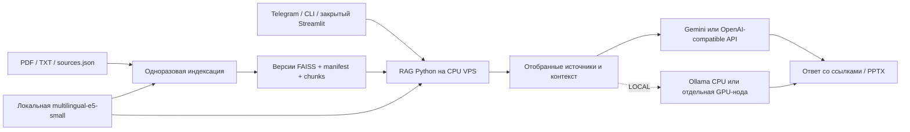

# Local-first Hybrid RAG: аудит и архитектурный план

Дата: 2026-09-29. Ревизия 2 после архитектурного ревью. Статус: спецификация
и план ожидают согласования; production-реализация не начата.
Репозиторий: https://github.com/vitalpicnic/rag, локальная база `b2c8022`.
В начале повторного аудита единственное незакоммиченное изменение — эта
спецификация, оставшаяся от предыдущего этапа. Код приложения не изменялся.
Предыдущий brainstorming сформировал архитектурный проект, но согласование
спецификации не было завершено. Текущий запрос разрешает ревью и подготовку
плана; явно запрещает изменение production-кода до согласования обоих документов.

## 1. Цель и границы

Перенести существующее приложение на один Linux VPS: документы, embeddings,
FAISS, подготовленные таблицы и поиск остаются на сервере; генерация выполняется
внешней LLM через Gemini либо OpenAI-compatible API. Опционально генерация
переключается на Ollama на том же сервере или отдельной GPU-ноде без изменения
retrieval. Наличие GPU не должно быть обязательным для HYBRID.

Сохраняются Telegram, CLI, Streamlit, четыре аналитических режима, проверяемые
источники и страницы, реестр официальной отчётности, PPTX, проверенные банковские
графики, история, метрики, атомарная публикация и контроль целостности индексов.
Сбор Telegram-каналов через пользовательскую учётку остаётся вне задачи.

Профиль HYBRID означает локальную обработку и внешнюю генерацию. Отдельное
понятие hybrid retrieval означает FAISS + BM25: оно включено в этап 5 вместе
с опциональным reranking и последовательными экспериментами A–F. Эти два
переключателя независимы. Kubernetes, Redis, PostgreSQL, отдельный
публичный REST API и публичная регистрация пользователей не требуются.

Local-first не означает отсутствие передачи данных: внешняя LLM получает вопрос,
отобранные фрагменты и ограниченную историю, Telegram — вопросы, ответы и явно
запрошенные файлы. Полный корпус не отправляется на embedding API в локальном
профиле. Автоматического перехода на облачные embeddings при локальной ошибке нет.

## 2. Результаты аудита

| Наблюдение | Основание | Требуемое изменение |
|---|---|---|
| Embeddings документов и вопросов всегда Google | `build_index.py:create_embeddings`, `rag/engine.py:setup_rag_chain` | Независимые фабрики embeddings и LLM; локальный профиль без Google-ключа |
| Пространство векторов жёстко задано: Gemini, 3072 измерения | `rag/index.py:DEFAULT_SETTINGS` | Профиль модели в fingerprint; явная проверка пространства на сборке и чтении |
| FAISS уже имеет версии, manifest, хеши, блокировку сборки и атомарный current.json | `rag/index.py` | Сохранить свойства; добавить проверяемое переключение и откат версии |
| Старый docstore десериализуется через pickle | `rag/index.py:_load_version` | Новые индексы без pickle; контролируемая совместимость с доверенными старыми версиями |
| Проверка актуальности перечитывает корпус и артефакты на каждый запрос | `rag/index.py:current_index` | Сначала измерить на целевом корпусе; не ослаблять контроль целостности ради переноса |
| Генерация напрямую зависит от Gemini | `rag/engine.py`, `rag/models.py` | Сохранить Gemini; добавить опциональный адаптер Ollama с отдельными параметрами |
| Метрики retrieval всегда помечены как gemini-embedding-001 | `rag/pipeline.py` | Записывать фактические провайдер и модель; не приписывать Google стоимость локальных операций |
| Пути привязаны к директории исходного кода | engine, bot, build_index, tables, metrics | Общая конфигурация root для постоянных данных; прежнее поведение вне Docker |
| Нет Dockerfile, Compose, Linux provisioning и процедуры восстановления | Корень репозитория | Реальные файлы инфраструктуры и скрипты, а не инструкции агенту |
| Пустой список разрешённых Telegram ID открывает бота всем | `bot.py:authorized` | В production-профиле требовать allowlist; прежний локальный режим сохранить явно |
| Streamlit не имеет пользовательской аутентификации | `app.py` | Публиковать только на loopback VPS; доступ через SSH-туннель |
| Ключи читаются из окружения/.env; поддержки файлов секретов нет | `.env.example`, запуск провайдеров | Поддержка переменных *_FILE для Compose secrets; исключение секретов из image/context/logs |
| `bot.py --check` сообщает not_ready, но не делает запуск проверки неуспешным | `bot.py:main` | Отдельная строгая readiness-проверка с ненулевым exit code |
| Зафиксированы прямые, но не все транзитивные зависимости | requirements-файлы | Linux lock-файлы с хешами, CPU-зависимости отдельно от GPU |
| CI проверяет Python, но не контейнеры | `.github/workflows/tests.yml` | Сборка образа, Compose validation, offline smoke и восстановление в Linux CI |

### 2.1 Фактический baseline повторного аудита

2026-09-29: штатный `unittest discover -s tests` выполнен через TextTestRunner
с фиксацией каждого passed/skipped/error в JSON. **78 passed, 0 failed,
0 errors, 0 skipped**, Python 3.14.3, Windows 11, exit code 0.
Отчёты: `reports/stage0-baseline-2026-09-29.json` и одноимённый `.log`;
они локальные и исключены из Git. Первое сохранение отчёта завершилось
PermissionError песочницы; повторный запуск с разрешением успешно сохранил
результат. Ошибка записи не была ошибкой теста приложения.

Оба условных теста реального банковского PDF выполнены, а не пропущены:
`TableTests.test_real_pdf_values_roundtrip_and_png` и
`TableTests.test_missing_and_modified_table_fail_closed`. Первый проверяет
10 наблюдений, SQLite roundtrip, значения и PNG; второй — отказ при повреждении
таблицы. Работа идёт с временными БД, production SQLite не изменялась.

Проверен существующий evaluation-набор через `read_dataset/check_dataset`:
30 cases, 43 проверки цитируемых фрагментов, 0 несовпадений, 47 файлов корпуса.
Фактически runner запускает 28 случаев в text и 2 в overview; executive/expert
не покрыты. Отсутствие поля mode в JSON не означает, что все 30 запускаются text:
`rag/evaluation.py:62` выводит режим из category.

- SHA-256 evaluation-набора: `3340cef9f9adc5f452f30e00b25eeaeed6535e74f5850c8747844b155e9fee93`.
- Версия корпуса по штатному evaluator: `49b873fe08f88203359e44d840db73bb50ff0b633e85b0ee65a2bcdeb352001a`.
- `faiss_indexes/Банкинг/current.json` и директория этого индекса отсутствуют.
  Readiness для evaluation: **not ready**, это не успешный retrieval.
- Gemini quality baseline A: **not_run**; исходный код и gold evidence сохранены,
  но измеренных Recall/accuracy/стоимости Gemini в этом аудите нет. Никакие
  production-индексы не строились и не переключались.
- Из Git отслеживаются только `data/README.md` и `reports/README.md` среди
  проверенных путей данных; `.env`, corpus, faiss_indexes, prepared_tables не tracked.

Unit baseline не проверяет внешние API, реальный локальный embedding,
Linux/Python 3.12, конкурентную нагрузку или GPU.

Docker CLI 29.4.3 и Compose 5.1.4 доступны при проверке вне песочницы.
Docker Desktop Linux Engine недоступен: named pipe отсутствует.
VPS ещё не выбран; SSH-развёртывание и нагрузочное испытание не выполнялись.

## 3. Базовый VPS и отдельный стенд измерений

| Параметр | Основной VPS по текущему ТЗ | Стенд ресурсной калибровки |
|---|---|---|
| ОС | Ubuntu Server 24.04 LTS, x86_64 | Та же |
| CPU | 4 vCPU | 4 vCPU, фактическую модель CPU записать |
| RAM | 8 ГБ | 16 ГБ |
| Диск | 80 ГБ SSD/NVMe как начальная оценка | SSD/NVMe, объём и свободное место измерить |
| GPU | Не нужен | Не нужен |
| Режим работы | Один polling-бот, опциональный закрытый Streamlit | Нагрузка 1/2/4 клиента, все роли |

Предыдущая оценка 2 vCPU / 4 ГБ больше не является целевой конфигурацией.
База 4 vCPU / 8 ГБ задана пользователем; приёмка на ней ещё не выполнена.
Начальная область измерения — до 10 000 фрагментов с указанием реального размера,
а не обещание верхнего предела корпуса. Индексация сначала запускается отдельно
от пользовательской нагрузки. Для
предотвращения двойной загрузки модели сохраняется один экземпляр на процесс,
общий для тем. Swap допускается как аварийный запас, но не как замена RAM.

Для 10 000 векторов по 384 float32 сами векторы занимают около 14,6 МиБ;
к этому прибавляются модель, Python/PyTorch, документы, метаданные и временная
память построения. Планирование диска учитывает исходный корпус, ограниченное
число образов/версий и резервные копии вне этого VPS.

Для 8 ГБ начальные лимиты: bot 3 ГиБ, web 2 ГиБ, indexer 4 ГиБ только в отдельном
окне обслуживания; оставлять не менее 1 ГиБ хосту. Лимиты уточняются измерением,
не доказывают фактическое потребление. При превышении: отключить второй frontend,
снизить embedding batch до 1–8, ограничить параллельность до 1 либо вынести
Ollama/индексацию. Не включать все контейнеры с суммой лимитов выше RAM.

LOCAL с Qwen3 8B/14B не обещается как комфортный режим на базовых 8 ГБ.
Проверка этих моделей идёт на 16 ГБ и/или GPU-ноде; quantization, context length,
KV cache, digest и ограничения concurrency фиксируются. Размер файла весов
не равен необходимой RAM. Если 14B не помещается с резервом, результат —
resource_blocked с конкретным предложением отдельной ноды/снижения контекста.

## 4. Архитектура

Рассмотрены три подхода:

1. **Локальные embeddings внутри Python-процесса — выбран для первого VPS.**
   Минимум сервисов и сетевых зависимостей; при двух интерфейсах два процесса
   могут держать две копии модели, поэтому начальный профиль запускает один,
   а второй включается после проверки общего бюджета RAM на базовых 8 ГБ.
2. Выделенный embedding-сервис — пригоден при нескольких процессах/пользователях,
   но добавляет API, контроль доступа и мониторинг; в первом этапе не нужен.
3. Полностью локальная LLM на CPU — поддерживается профилем LOCAL, но не является
   основным production-вариантом для 8 ГБ. Нагрузка калибруется отдельно;
   предусмотрена GPU-нода с тем же контрактом Generation Provider.

### 4.0 Профили и независимые компоненты

| RAG_PROFILE | Embedding Provider | Generation Provider | Политика |
|---|---|---|---|
| HYBRID | local | gemini или openai_compatible | Основной VPS; ключ только выбранного генератора |
| LOCAL | local | ollama | Никаких внешних LLM/embedding API; модели заранее загружены |
| CLOUD | google | gemini | Исходный Gemini embedding-профиль и совместимость schema v1 |

В Compose по умолчанию HYBRID. Для прежнего запуска без RAG_PROFILE сохраняется
явно документированный CLOUD-default, чтобы не ломать существующий .env/индекс.
LOCAL + Gemini и CLOUD + local отклоняются, а не «исправляются» автоматически.
Профиль меняет провайдеров, режим text/overview/executive/expert — инструкции
и глубину retrieval. Эти настройки не должны смешиваться.

LOCAL блокирует создание внешних клиентов до импорта их SDK; случайно заданный
GOOGLE_API_KEY не разрешает обращение к Google. Ollama ограничена выделенным
закрытым endpoint; cloud-функции отключены, разрешены только заранее загруженные
локальные model digests. В однохостовом offline Compose сеть приложений/Ollama
internal, bootstrap download выполняется отдельно. Для GPU-ноды — allowlist
private endpoint и egress-правила. Проверяется реальный ответ с отключённым WAN;
одной проверки имени провайдера недостаточно. Telegram при этом требует сеть
Telegram; полностью отключённый интернет проверяется через CLI, не polling.

| Компонент | Реализация/граница | Контракт |
|---|---|---|
| Generation Provider | `rag/generation.py`, адаптеры Gemini/OpenAI-compatible/Ollama | Сообщения → AIMessage с usage и моделью; таймаут, retry, лимит вывода |
| Embedding Provider | `rag/embeddings.py` | embed_documents/embed_query + immutable embedding fingerprint |
| Document Processing | `rag/documents.py`, выделение существующего extract_chunks | PDF/TXT → chunks с прежними source/page/chunk ID |
| Index Manager | `rag/index.py`, CLI `scripts/manage_index.py` | Проверка, версия, атомарная публикация/активация/откат |
| Retrieval | `rag/retrieval.py`; IndexRetriever остаётся совместимым адаптером | Вопрос + режим → ранжированные документы с метаданными |
| Evidence Validation | `rag/evidence.py`, `rag/sources.py`, `rag/tables.py` | Структура ссылок отдельно от проверенных числовых фактов |
| RAG Orchestrator | `rag/pipeline.py`, wiring `rag/engine.py` | Retrieve → evidence → generation → validation; без знания UI |
| Interface Adapters | bot.py, main.py, app.py | Сессии, авторизация, очередь, файлы; общий engine |
| Evaluation | rag/evaluation.py, scripts/evaluate_rag.py | Версионированный набор, результаты/статусы/ручная разметка |
| Observability | rag/metrics.py, rag/health.py, scripts/benchmark_rag.py | События по стадиям, readiness, ресурсы, раздельная стоимость |

Это границы модулей существующего приложения, а не требование десяти сервисов.

### 4.1 Конфигурация приложения

Новый модуль `rag/config.py` валидирует настройки до загрузки моделей.
Конфигурация окружения и файлы секретов работают независимо от наличия .env.

- `RAG_ENV=development|production`: политика эксплуатации, независимая от LOCAL.
- `RAG_PROFILE=HYBRID|LOCAL|CLOUD`: матрица выше.
- `RAG_DATA_ROOT`: общий корень постоянных данных; по умолчанию корень проекта.
- `RAG_EMBEDDING_PROVIDER=google|local`: Google сохраняется для прежних запусков,
  Compose явно выбирает local.
- Локальные model ID, revision, путь к кэшу, offline-режим, batch size и число CPU
  threads задаются явно и проверяются.
- `RAG_LLM_PROVIDER=gemini|openai_compatible|ollama`; `RAG_MODEL` сохраняет назначение.
- OpenAI-compatible: обязательные base URL/model, собственный ключ и *_FILE;
  не пересылать Gemini thinking-параметры произвольному совместимому серверу.
- `GOOGLE_API_KEY_FILE`, `TELEGRAM_BOT_TOKEN_FILE`: содержимое читается приложением,
  секретные значения не выводятся. Конфликт env/file отклоняется явно.
- `OLLAMA_BASE_URL` и имя модели применяются только при выборе Ollama.

Существующие CLI-аргументы сохраняются. Readiness не обращается к платной LLM.
Неизвестный провайдер, неверные лимиты или недоступная локальная модель дают
понятную ошибку до обработки пользовательского вопроса.

### 4.2 Локальные embeddings

Базовая модель — `intfloat/multilingual-e5-small`, CPU, 384 измерения.
Для retrieval нужны разные префиксы `query: ` и `passage: `, в том числе для
русского текста; применяется нормализация. Это требования модели, а не
взаимозаменяемые параметры. Ограничение длины модели учитывается при обработке
вопросов и фрагментов; длинные входы не должны незаметно терять текущий вопрос.

Используется Sentence Transformers с CPU-сборкой PyTorch. Revision модели,
зависимости и параметры фиксируются при реализации после проверки совместимости
на Python 3.12/Linux. `trust_remote_code` не включается.
Отдельная bootstrap-команда скачивает модель один раз; runtime читает локальный
кэш без автоматического скачивания или скрытого сетевого fallback.

### 4.3 Индексы и миграция

Существующий legacy-профиль Gemini/3072 сохраняется неизменным, чтобы не ломать
fingerprint уже построенных версий. Новый локальный профиль включает provider,
model ID, revision, размерность, нормализацию, префиксы, версии клиента и FAISS.
Недостаточно сравнивать только размерность: разные модели одинаковой размерности
тоже несовместимы.

Переход на local требует нового embedding документов. Старые файлы не удаляются,
векторы не переименовываются и не переиспользуются в новом пространстве.
Построение завершается проверкой сохранённой версии; только после этого
публикуется указатель. Ошибка или прерывание оставляет прежнюю рабочую версию.
Для новых пространств отдельный namespace
`faiss_indexes/<topic>/profiles/<embedding_fingerprint>/versions/<version>` и
собственный current.json. Legacy `faiss_indexes/<topic>/current.json` сохраняется
нетронутым. Generating model, API URL и роль не входят в embedding fingerprint.
BM25/reranker имеют собственную конфигурацию и версии артефактов.

Откат внутри пространства меняет только проверенный указатель; откат между
пространствами — согласованное переключение конфигурации на ранее готовый
namespace. Обе операции без повторного embedding и удаления файлов. Нужны CLI
list/verify/activate и тесты неверной версии/профиля. При изменении корпуса откат
к старому индексу запрещён до явного восстановления соответствующего корпуса
в отдельный root. Production-корпус автоматически не переписывается.

Новый формат schema v2 использует JSONL и явный row→chunk_id mapping с хешами,
без исполнения pickle. Legacy schema v1 остаётся доступной для доверенных
локальных артефактов через изолированный совместимый путь; административная
миграция выполняется на копии в отдельный root и сохраняет порядок векторов
и source/chunk ID. Перенос формата не меняет embedding; замена Google→local
всегда требует новых векторов. Хеширование
обнаруживает повреждение, но не аутентифицирует файлы, если атакующий может
заменить одновременно индекс, manifest и указатель. Поэтому runtime не получает
прав записи в индексы; внешние пользовательские index.pkl не импортируются.

### 4.4 Контейнеры и постоянные данные

Реальные артефакты реализации:

| Артефакт | Назначение |
|---|---|
| `Dockerfile` | CPU-образ приложения, Python 3.12, non-root runtime, build/runtime разделение |
| `.dockerignore` | Исключение .env, ключей, .git, локального корпуса, индексов и окружений |
| `compose.yaml` | app CLI, единственный bot, web, indexer, model bootstrap; лимиты, secrets, volumes, healthcheck |
| `compose.local.yaml` | Опциональная Ollama CPU, internal network, LOCAL без внешних API |
| `deploy/ollama/compose.yaml` | Отдельный проект GPU-ноды с pinned image, NVIDIA runtime и закрытым портом |
| `deploy/*.env.example` | Несекретные параметры основного VPS и GPU-ноды |
| Linux lock-файлы | Воспроизводимые зависимости с хешами; CPU wheels без CUDA на основном VPS |
| `scripts/bootstrap-vps.sh` | Проверка ОС, установка Docker из официального apt-репозитория, каталоги и права |
| `scripts/backup.sh`, `scripts/restore.sh` | Согласованная резервная копия, проверка и восстановление в отдельный root |
| `rag/health.py` | Readiness и проверка живости процесса без платных сетевых вызовов |
| `scripts/smoke_local.py` | Реальный локальный embedding, FAISS retrieval и проверка источников |
| `scripts/benchmark_rag.py` | Измерения cgroup/процессов/CPU steal/latency на 8 и 16 ГБ |
| CI workflow | Unit/integration, сборка image, Compose validation, smoke и restore |

Данные размещаются под отдельным root, например `/state`: `data`,
`faiss_indexes`, `prepared_corpora`, `prepared_tables`, `logs`, `reports`.
Кэш модели отделён от корпуса. В runtime исходные документы, индексы и модель
монтируются read-only; отдельный tools-контейнер получает необходимые write mounts.
Логи/экспорт имеют отдельные writable mounts, `/tmp` — tmpfs.

Образы и зависимости фиксируются проверенными версиями/digest; `latest` не
используется как production-конфигурация. Секреты не копируются в образ и не
передаются build args. Compose secrets на одном сервере не заменяют защиту
исходных файлов и диска; bootstrap задаёт права и проверяет доступ UID контейнера.

Runtime: non-root UID, `cap_drop: ALL`, `no-new-privileges`, read-only rootfs,
лимиты памяти/CPU/PID, ограничение логов, корректное завершение и restart policy.
Не монтируется Docker socket и не используется privileged/host networking.

По умолчанию бот работает через polling без входящего порта. Web публикуется
только на `127.0.0.1:8501`; доступ — SSH-туннель. Публичный домен, TLS и
аутентифицирующий reverse proxy потребуют отдельного явно включаемого профиля.
Нельзя считать UFW единственной защитой опубликованных Docker-портов.

Compose не запускает bot автоматически в нескольких профилях. Дополнительно
polling-процесс берёт flock на общий persistent runtime volume до инициализации
Telegram; второй процесс завершается с ошибкой, lock освобождается при смерти
первого. Отдельные хосты с одним токеном запрещены процедурой эксплуатации.
Indexer — одноразовый фоновый job с `restart: no`, использует существующий lock;
он не выполняет embedding на каждом старте web/bot и не перезапускается бесконечно.

### 4.5 Ollama

GPU-нода подключается через закрытую сеть/VPN или SSH-туннель. Compose разных
серверов не образуют общую сеть автоматически. Порт 11434 не выставляется
публично; localhost хоста и localhost контейнера не взаимозаменяемы.
Конкретный private endpoint и маршрут задаются в конфигурации развёртывания.

Нужны NVIDIA driver/Container Toolkit, постоянный volume модели, фиксированная
версия образа и зарегистрированный digest загруженной модели. Выбор LLM и VRAM
определяется отдельно, основной VPS их не требует. Таймауты, ограничение очереди
и отказ при недоступности ноды проверяются тестами. При переключении LLM индекс
не перестраивается. Отказ Ollama не включает платный Gemini без явной настройки.

### 4.6 Эксплуатация

- Различать liveness процесса и readiness модели/выбранного индекса/секретов.
  Наличие импортируемого Python-модуля не считается готовностью приложения.
- Heartbeat бота обновляется его event loop, а не независимым healthcheck-процессом.
- Логи содержат фактические модели, время, статус и usage без документов,
  вопросов, ответов и ключей; токены чужого провайдера не тарифицируются как Gemini.
- Backup включает документы, sources.json, все нужные версии и указатели,
  таблицы и конфигурацию версий; секреты хранятся отдельно защищённо.
- Для минимального пилота backup выполняется в коротком окне обслуживания без
  индексирования и изменения корпуса. Restore сначала в новый каталог,
  проверка контрольных сумм/readiness/retrieval, затем переключение.
- Обновление образа и откат данных — разные операции. Изменение модели embeddings
  требует согласованного выбора версии индекса. Автоматическое удаление старых
  индексов и backups в первоначальном переносе не включается.

## 5. Этапы реализации и приёмка

Каждый этап выполняется через тест → наблюдаемый отказ → реализацию → успешную
проверку. Проверки, требующие сети, платного API или GPU, отделяются от offline.

| Этап | Результат | Критерии приёмки и откат |
|---|---|---|
| 0 — аудит | Актуальная спецификация, risks, baseline и implementation plan | Факты/скрипы проверок зафиксированы, модель A обозначена not_run; согласование владельца до кода; отдельный docs commit |
| 1 — провайдеры | Независимые generation/embedding factories, матрица профилей | CLOUD совместим; HYBRID/OpenAI-compatible и LOCAL не требуют Google-ключа; тесты отсутствия fallback; revert коммита возвращает старый wiring |
| 2 — embeddings и FAISS | Локальная модель, namespace/schema v2, legacy reader, миграция | Реальное offline encode/retrieval; same-dimension mismatch отклоняется; прерывание/ошибка API не меняют current; откат на старый namespace/образ |
| 3 — HYBRID VPS | Реальные Docker/Compose/bootstrap, интерфейсы, deployment smoke | 4 vCPU/8 ГБ без GPU, все роли и PPTX/SQLite; strict access, restart сохранность; откат образа + прежнего профиля без удаления volumes |
| 4 — LOCAL/Ollama | CPU Compose и отдельный GPU compose, отсутствие WAN зависимости | Реальный CLI ответ после preload при блокировке внешних API; API timeout без fallback, индекс тот же; отключение Ollama-профиля и явный выбор прежнего |
| 5 — retrieval/quality | BM25, fusion, reranker, эксперименты A–F и расширение evaluator | Сравнение одного изменения за раз, четыре роли, quality/resource отчёты; переключение dense/rerank=false без переиндексации FAISS |
| 6 — production | Ограничения, мониторинг, backup/restore, измерения и runbook | Restore на чистом root, лимиты и нагрузка проверены, все 13 критериев сведены к свидетельствам; откат образа/конфига и проверенного snapshot |

Подробные файлы, интерфейсы, тесты, commits и rollback:
[план реализации](../plans/2026-09-29-local-first-vps.md).
Критические меры доступа и секретов внедряются уже в этапе 3, не откладываются
до этапа 6. Каждый этап заканчивается собственным commit; незавершённый живой
smoke явно отмечается blocked/not_run и не превращается в «этап проверен».

Ключевой тест Local-first: после загрузки модели в контейнере с `--network none`
реальная локальная модель строит небольшой индекс и находит подтверждающий
фрагмент русскоязычного документа. Google embeddings не инициализируются.
Отдельный smoke с подставной LLM проверяет полный ответ со ссылками без оплаты API.
Живой тест Gemini проверяет совместимость при наличии ключа, но не подменяется
успехом тестового объекта. Аналогично отсутствие GPU означает непроверенный
живой GPU-сценарий, а не успешный результат.

Память, latency и диск измеряются и сохраняются в машинном отчёте. Совпадение
качества локальных embeddings с Google заранее не обещается: нужны контрольные
русскоязычные вопросы, ожидаемые источники и отдельные результаты retrieval.

## 6. Навыки и источники

Существующий результат brainstorming пересмотрен через receiving-code-review;
план подготовлен через writing-plans по явному запросу пользователя на этап 0.
Дальнейший процесс после согласования: executing-plans, test-driven-development,
systematic-debugging при сбоях и verification-before-completion.
По инструкции пользователя работа выполняется без субагентов.

Docker Skills и отдельные навыки Linux/security/deployment не обнаружены ни в
каталоге доступных навыков, ни поиском установленных SKILL.md. В соответствии с
запросом пользователя применяются первичные источники:

- [Docker: установка на Ubuntu](https://docs.docker.com/engine/install/ubuntu/)
- [Docker: профили Compose](https://docs.docker.com/compose/how-tos/profiles/)
- [Docker: secrets](https://docs.docker.com/compose/how-tos/use-secrets/)
- [Docker: volumes](https://docs.docker.com/engine/storage/volumes/)
- [Docker: безопасность Engine](https://docs.docker.com/engine/security/)
- [Docker: GPU в Compose](https://docs.docker.com/compose/how-tos/gpu-support/)
- [Модель multilingual-e5-small](https://huggingface.co/intfloat/multilingual-e5-small)
- [SentenceTransformer: revision, cache и local_files_only](https://www.sbert.net/docs/package_reference/sentence_transformer/SentenceTransformer.html)
- [Ollama: networking, GPU и ограничения памяти](https://docs.ollama.com/faq)
- [Python: ограничения безопасности pickle](https://docs.python.org/3/library/pickle.html)
- [Ollama: OpenAI-compatible контракт](https://docs.ollama.com/api/openai-compatibility)
- [Qwen3 в Ollama](https://ollama.com/library/qwen3)
- [Локальный multilingual reranker](https://huggingface.co/cross-encoder/mmarco-mMiniLMv2-L12-H384-v1)
- [Docker: внутренние и межсерверные сети](https://docs.docker.com/compose/how-tos/networking/)
- [Linux cgroup v2: учёт памяти и CPU](https://www.kernel.org/doc/html/latest/admin-guide/cgroup-v2.html)

Следующий шаг: согласование данного архитектурного проекта и связанного
плана реализации по файлам и тестам. Реальные конфигурации приложения будут
созданы на этапе реализации; этот документ ими не является.

## 7. Технические свидетельства и матрица рисков

Номера строк относятся к production-коду `b2c8022`; выдержки показывают
проверенное поведение, а не текст инструкций для агента.

| Проверяемая часть | Файл и подтверждающий фрагмент | Вывод |
|---|---|---|
| Embedding и ключи | `build_index.py:14–24`: `if not os.getenv('GOOGLE_API_KEY')`, затем `GoogleGenerativeAIEmbeddings(...)` | Локального адаптера нет; Google-ключ нужен даже для поиска |
| Генерация | `rag/engine.py:29–37`: `current_index(...)`, `create_embeddings(...)`, `llm = ChatGoogleGenerativeAI(...)` | Провайдеры связаны в wiring, LLM не абстрагирована |
| Роли | `rag/analysis.py:response_instructions/retrieval_size`, `rag/engine.py:62–63`: `max_output_tokens=1800/3000` | Роли действительно меняют бюджет и кандидатов; это надо сохранить |
| Подготовка корпуса | `rag/index.py:21,77`: `size: 1000`, `overlap: 100`, `extract_chunks`; `:299`: `prepare_corpus` | Есть offline подготовка и chunk provenance; нет отдельного Document Processing интерфейса |
| Версии индекса | `rag/index.py:142–151`: hash manifest, fingerprint, hashes artifacts; `:221`: `os.replace(temporary, base / 'current.json')` | Целостность и публикация уже реализованы, переписывать заново не нужно |
| Legacy загрузка | `rag/index.py:183`: `docstore, mapping = pickle.load(handle)` | Нужен доверенный legacy reader и безопасный новый формат |
| Evidence | `rag/evidence.py:112–117`: regex `\[S(\d+)\]` и диапазон ID | Структурная ссылка не проверяет entailment или правильность цифр |
| Честный статус | `rag/pipeline.py:67–68`: `cited_unverified`, `retrieval_calibrated: False` | Нельзя назвать текущие ответы семантически проверенными |
| Приоритет источников | `rag/sources.py:47`: `record['sha256'] != metadata.get('source_sha256')` | Официальный статус зависит от operator registry и точного файла |
| Telegram | `bot.py:55`: `if ALLOWED_IDS and ...`; `:39`: `SerialWorker(queue_size=8)` | Пустой allowlist открывает доступ; очередь ограничена внутри одного процесса, не между экземплярами |
| Streamlit/CLI | `app.py:92`: session key содержит chat_id/topic/mode; `main.py:11,42`: `--mode`, `chain.invoke` | Интерфейсы сохраняются; аутентификации публичного web нет |
| SQLite | `rag/tables.py:36`: SOURCE_HASH; `:74`: `?mode=ro`; `:28`: `expected_rows` | Проверены конкретные 10 наблюдений, не произвольные показатели всех PDF |
| PPTX | `rag/slides.py:16,32`: `can_export`, `export_answer_pptx`; `:28`: выбор коротких cited excerpts | Экспорт локальный, без нового LLM; он не повышает достоверность исходного ответа |
| Evaluation | `rag/evaluation.py:22,62`: `page_recall`, category→text/overview | Нет Recall@фиксированный k, отдельного числового score, executive/expert matrix |
| Наблюдаемость | `rag/pipeline.py:28`: `model='gemini-embedding-001'`; `rag/metrics.py:59` | Model label жёсткий; RAM/CPU/steal и отдельного reranking timing нет |
| CI/зависимости | `.github/workflows/tests.yml`: Python 3.12 Windows/Linux; requirements: direct pins | Нет проверок контейнеров, lock транзитивных версий и реального offline embedding |

P0 — блокирует публикацию с конфиденциальными данными; P1 — обязательное
исправление перед приёмкой затронутого этапа; P2 — эксплуатационный риск.
Риск не означает, что инцидент уже произошёл.

| ID | Уровень / характер | Риск и условие | Мера и этап |
|---|---|---|---|
| R01 | P0, наблюдаемое поведение | Пустой Telegram allowlist даёт доступ любому пользователю бота | production fail-closed, явный opt-in только для development; этапы 1/3 |
| R02 | P0, риск публикации | Streamlit/Ollama или внутренние API доступны извне без защиты | loopback/internal, закрытый GPU endpoint, тест портов; 3/4 |
| R03 | P0, риск миграции | Модель или кодирование меняются при использовании старых векторов | Полный encoding fingerprint, namespaces, проверка перед embedding/поиском; 2 |
| R04 | P0, риск LOCAL | Ошибка локальной модели вызывает скрытый внешний запрос или Ollama cloud | Матрица провайдеров + egress isolation + локальные digests + тест WAN-off; 1/4 |
| R05 | P1, наблюдаемое ограничение | Валидный [S1] может сопровождать неверную цифру/вывод | Раздельные citation/numeric/entailment checks, authoritative table guard; 3/5 |
| R06 | P1, trust boundary | Недоверенный pickle может исполнять код; хеши не защищают от владельца записи | JSON schema v2, legacy read только доверенные артефакты, ro runtime; 2/3 |
| R07 | P1, неподтверждённый baseline | Для gold corpus нет current.json; качество модели A не измерено | Сохранить A отдельно, сначала измерить его, затем B–F; 0/1/5 |
| R08 | P1, риск воспроизводимости | Зависимости/модель могут измениться при новом deploy | Hash-locked deps, model revision, image digest, smoke Linux 3.12; 2/3 |
| R09 | P1, ресурсы | Несколько копий модели, indexer и 14B приводят к OOM | Лимиты/раздельные jobs/CPU threads, стенды 8 и 16 ГБ; 3/4/6 |
| R10 | P1, сохранность | Непроверенная backup-копия содержит несогласованные указатели/SQLite | Окно backup, hashes, restore в новый root и retrieval, SQLite integrity; 6 |
| R11 | P1, готовность | `--check` может закончиться кодом 0 при not_ready | Строгая readiness отдельно от liveness; 3 |
| R12 | P2, нагрузка | Полный hash корпуса на каждом query увеличивает I/O; очередь скрывает latency | Раздельные queue/retrieval timing; сначала измерить, сохранять integrity; 5/6 |
| R13 | P2, диагностика | Нет CPU steal, RAM, reranking latency; стоимость завязана на Gemini | OS/cgroup отчёт, provider-specific usage/pricing, N/A вместо 0; 1/5/6 |

## 8. Качество и последовательные эксперименты

До изменений сохраняются commit `b2c8022`, точные prompts, generation options,
embedding settings, corpus/dataset/code hashes и доступные legacy manifests.
Полноценный baseline A запускается в изолированном root с копией gold corpus;
при отсутствии индекса требуется явная сборка только в этом root. Он не
заменяется тестовым embedding или результатом PDF evidence check.
Недоступность ключа/корпуса/API фиксируется `blocked`, не как нулевая accuracy.
Точные ответы и документы evaluator остаются в локальных отчётах, не в Git.

| Эксперимент | Embedding | Retrieval | Generation | Сравнение |
|---|---|---|---|---|
| A | Исходный Google | FAISS | Исходный Gemini | Замороженный эталон |
| B | multilingual-e5-small | Тот же FAISS-поиск/выбор evidence | Тот же Gemini | Только embedding относительно A |
| C | Как B | FAISS + BM25 + reciprocal rank fusion | Как B | Только добавление lexical retrieval |
| D | Как C | Как C + локальный cross-encoder reranker | Как C | Только reranking |
| E | Как D | Как D | Qwen3 8B через Ollama | Только generation adapter/model относительно D |
| F | Как E | Как E | Qwen3 14B, тот же quantization class/context/output policy | Только размер модели относительно E |

BM25 строится из тех же chunks с теми же ID, corpus/processing fingerprint и
своим tokenizer version; NFKC/casefold + Unicode tokenization, числа сохраняются.
Индекс — JSON-данные, не pickle. RRF: k=60, одинаковый вес dense/sparse,
детерминированный tie-break по chunk ID; нельзя складывать raw L2 и BM25 scores.
Вначале кандидаты по бюджету роли, union/dedup, RRF, при включении rerank top 20,
затем существующие evidence limits/официальный приоритет/сохранение альтернатив.
BM25/reranker не меняют FAISS векторы; выключение возвращает dense без rebuild.

Начальный reranker — `cross-encoder/mmarco-mMiniLMv2-L12-H384-v1`, CPU, revision
зафиксирована при упаковке. Не объявляется улучшением до результатов C→D.
Для Qwen3 фиксируются Ollama model digest, quantization, контекст и thinking
policy; E/F получают одинаковые retrieval результаты и одинаковый prompt.
Различия tokenizer и фактических токенов записываются, не приравниваются механически.

В каждом эксперименте выполняются исходные 30 cases как отдельный legacy slice
и явная матрица text/overview/executive/expert на проверенных фактах. Новые
ожидаемые ответы, numeric tuples и источники допускаются только после проверки
в исходных PDF; категории/схема/хеши набора версионируются. Смена prompts,
chunking или temperature требует отдельного эксперимента, а не прячется в B.

После инфраструктурных изменений сначала выполнить контрольный A на новых
адаптерах с замороженными входными сообщениями и options исходного A. Проверить
идентичность prompt payload, chunk order и generation options; original A
остаётся отдельным неизменяемым отчётом. Новые numeric guards оценивать
одинаковым postprocessing над raw answers всех A–F и показывать raw/guarded
метрики раздельно. Изменение prompt/контекста ради hardening нельзя маскировать
как эффект local embeddings. При несовпадении inputs сначала устраняется
расхождение или вводится отдельный явно названный control arm.

Метрики по каждому режиму и случаю:

- Recall@3/5/10 до evidence selection и отдельно recall окончательного context;
  единица gold — нормализованные source+page, denominator явно задан. При пустом
  gold значение N/A; такие случаи отдельно оцениваются по отказу.
- Citation validity автоматически; supporting-evidence precision/entailment
  по ручной разметке атомарных утверждений, reviewed/unreviewed раздельно.
- Numeric accuracy: точное Decimal-сопоставление значения, единиц, entity,
  периода и периметра с reviewed gold; «42» на другой период не считается верным.
  Для проверенных SQLite-рядов LLM не может заменить значение: конфликт приводит
  к отказу/исправлению из проверенной таблицы и тестируется.
- Refusal precision/recall, hallucinated numeric claims, соблюдение роли,
  p50/p95 стадий, peak RSS/cgroup memory, размер индексов, API usage/cost.
- Стоимость без provider usage/pricing отмечается unknown; локальный API cost=0
  не означает нулевые расходы на сервер и электричество.

Проверка чисел из произвольного PDF не сводится к наличию того же числа где-то
на странице. Для непроверенных связей значение–период сохраняется unverified;
нельзя маркировать весь свободный текст как verified. Контрольная приёмка требует
100% корректности reviewed numeric cases и нулевого обхода source/table guards.
Для прочих метрик первоначальное правило продвижения: Recall@5 и доля
подтверждённых утверждений не ниже A на том же наборе; все случаи отказа разобраны.
Если B не проходит, CLOUD сохраняется как доступный профиль; HYBRID не объявляется
готовым по качеству. Для C/D отсутствие улучшения означает оставить dense default.
Порог абсолютной latency не выдумывается без SLO; регрессия >20% p95 отдельно
обосновывается качеством/ресурсами и не принимается молча.

LoRA/SFT и обучение LLM не входят в этапы. Сначала ошибки классифицируются как
extraction/retrieval/evidence/prompt/model; обучение допустимо только отдельным
решением после доказательств проблем поведения модели.

## 9. Ресурсная калибровка: протокол, а не вымышленные результаты

Стенд: 16 ГБ RAM с записью CPU, vCPU, ядра ОС, Docker, cgroup limits,
диска/free space, модели и всех digest. Отдельно проверка основного HYBRID на
8 ГБ; результаты 16 ГБ не доказывают работоспособность 8 ГБ автоматически.
Cold-start и warm run разделены; один прогрев, затем минимум 30 завершённых
запросов на каждую комбинацию concurrency 1/2/4 и режима. Порядок случаев
зафиксирован. Ограниченный initial API run предварительно считает количество
вызовов; ошибки/timeout включаются в denominator и отчёт.

| Измерение | Метод | Текущее значение |
|---|---|---|
| Память приложения | RSS процесса, cgroup memory.current/peak; раздельно shared/page cache | not_measured |
| Память embedding-модели | Разница RSS до/после загрузки в отдельном процессе + общий peak | not_measured |
| FAISS и метаданные | Байты каждого artifact и ntotal/dimension | not_measured для local |
| Пик индексации | Сэмплирование RSS/cgroup во время полного build | not_measured |
| CPU utilization и throttling | /proc/stat deltas и cgroup cpu.stat | not_measured |
| CPU steal | Разность steal/total из /proc/stat хоста; нет доступа → unavailable | not_measured |
| Query embedding / dense / sparse / rerank | monotonic spans, не включать очередь в retrieval | not_measured |
| Generation / полный ответ / очередь | Раздельные spans, p50/p95 + ошибки | not_measured |
| Свободный диск, лимиты | filesystem stat, docker inspect/cgroup; без Docker socket внутри app | not_measured |

Для выключенного reranking latency = not_applicable, а не измеренный ноль.
Текущая SerialWorker обрабатывает один запрос за раз; concurrent clients прежде
всего измеряют очередь. Настоящие 2/4 одновременных inference включаются только
отдельной конфигурацией после проверки RAM и маркируются отдельно.
При OOM останавливается наращивание нагрузки; при устойчивом высоком steal
результат связывается с noisy-neighbor VPS, а не приписывается embedding-модели.

## 10. Итоговая production-приёмка

| № | Требование | Свидетельство этапа | Статус сейчас |
|---|---|---|---|
| 1 | HYBRID на VPS без GPU | Linux smoke и параметры 4 vCPU/8 ГБ, этап 3 | not_run |
| 2 | Local embedding → совместимый FAISS | Реальные векторы и offline retrieval, этап 2 | not_run |
| 3 | Gemini baseline сохранён | Git/gold frozen + живой отчёт A до B | Код/gold сохранены; живой A not_run |
| 4 | Смена LLM без переиндексации | Нулевые embed_documents calls, неизменные FAISS hashes | planned, этапы 1/4 |
| 5 | Пространства не смешиваются | Mismatch tests, включая одинаковую размерность | planned, этап 2 |
| 6 | Проверяемые источники | Citations tests + review supporting evidence | Структурные tests passed; semantic review not_run |
| 7 | Проверенные числа не заменены догадками | SQLite guards + numeric evaluation | Текущие table tests passed; общий numeric gate planned |
| 8 | API error не повреждает индекс | Fault injection и неизменность указателя | planned, этапы 2/3 |
| 9 | Нет secrets/documents в Git | tracked paths, build context и тест redaction | Проверенные data/env paths не tracked; image not_built |
| 10 | Перезапуск сохраняет FAISS/SQLite | Container restart hashes + queries | not_run |
| 11 | Restore проверен | Новый root, hashes, integrity_check, retrieval | not_run |
| 12 | RAM/latency измерены | Машинный benchmark отчёт 8/16 ГБ | not_measured |
| 13 | Тесты документированы | Unit JSON/log + spec + Linux/API отчёты | Unit 78/0/0/0; остальные ещё не выполнены |

Ни один статус not_run/blocked/not_measured не считается готовностью.
Рабочий этап HYBRID нельзя объявить завершённым только по Windows unit-тестам
или валидному Compose YAML. При отсутствии VPS/API/GPU реализуемые части
проверяются локально, внешние проверки остаются явными пунктами приёмки.
